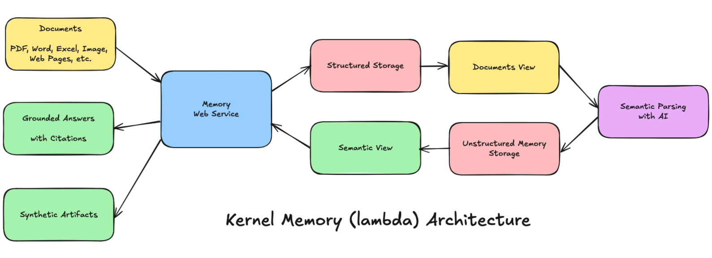
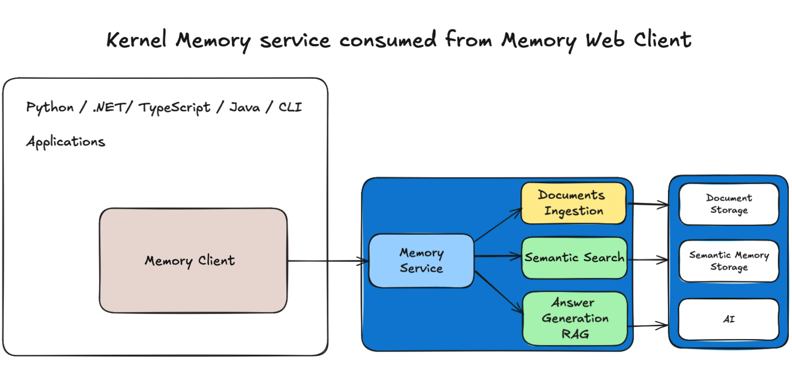

Kernel Memory
=============

[](https://github.com/microsoft/kernel-memory/blob/main/LICENSE)
[](https://aka.ms/KMdiscord)
[](https://hub.docker.com/r/kernelmemory/service)
[](https://www.nuget.org/packages/Microsoft.KernelMemory)
[](https://github.com/microsoft/kernel-memory/releases)

This repository presents best practices and a reference implementation for Memory in specific AI
and LLMs application scenarios. Please note that **the code provided serves as a demonstration**
and is **not an officially supported** Microsoft offering.

**Kernel Memory** (KM) is a **multi-modal [AI Service](service/Service/README.md)** specialized
in the efficient indexing of datasets through custom continuous data hybrid pipelines, with support
for **[Retrieval Augmented Generation](https://en.wikipedia.org/wiki/Prompt_engineering#Retrieval-augmented_generation)**
(RAG), synthetic memory, prompt engineering, and custom semantic memory processing.

KM is available as a **Web Service**, as a **[Docker container](https://hub.docker.com/r/kernelmemory/service)**,
a **[Plugin](https://learn.microsoft.com/copilot/plugins/overview)** for ChatGPT/Copilot/Semantic
Kernel, and as a .NET library for embedded applications.

Utilizing advanced embeddings and LLMs, the system enables Natural Language querying for obtaining
answers from the indexed data, complete with citations and links to the original sources.

Kernel Memory is designed for seamless integration as a Plugin with [Semantic Kernel](https://github.com/microsoft/semantic-kernel),
Microsoft Copilot and ChatGPT.




Kernel Memory Service on Azure
==============================

Kernel Memory can be deployed in various configurations, including as a **Service** in Azure.
To learn more about deploying Kernel Memory in Azure, please refer to the
[Azure deployment guide](https://microsoft.github.io/kernel-memory/azure).
For detailed instructions on deploying to Azure, you can check the [infrastructure documentation](/infra/README.md).

If you are already familiar with these resources, you can quickly deploy by clicking the following
button.

[](https://aka.ms/KernelMemoryDeploy2Azure)

🔗 See also: [Kernel Memory via Docker](#kernel-memory-docker-image) and [Serverless Kernel Memory with Azure services example](examples/007-dotnet-serverless-azure).

## Running Kernel Memory with Aspire

Kernel Memory can be easily run and imported in other projects also via .NET Aspire. For example:
```csharp
var builder = DistributedApplication.CreateBuilder();

builder.AddContainer("kernel-memory", "kernelmemory/service")
    .WithEnvironment("KernelMemory__TextGeneratorType", "OpenAI")
    .WithEnvironment("KernelMemory__DataIngestion__EmbeddingGeneratorTypes__0", "OpenAI")
    .WithEnvironment("KernelMemory__Retrieval__EmbeddingGeneratorType", "OpenAI")
    .WithEnvironment("KernelMemory__Services__OpenAI__APIKey", "...your OpenAI key...");

builder.Build().Run();
```

[](examples/303-dotnet-aspire/Program.cs)


Data Ingestion using Kernel Memory OpenAPI Web Service
======================================================

The example show the default documents ingestion pipeline:

1. Extract text: automatically recognize the file format and extract the information
2. Partition the text in small chunks, ready for search and RAG prompts
3. Extract embeddings using any LLM embedding generator
4. Save embeddings into a vector index such as
   [Azure AI Search](https://learn.microsoft.com/azure/search/vector-search-overview),
   [Qdrant](https://qdrant.tech/) or other DBs.

The example shows how to **safeguard private information** specifying who owns each document, and
how to **organize data** for search and faceted navigation, using **Tags**.

## C#

> ```csharp
> #r "nuget: Microsoft.KernelMemory.WebClient"
>
> var memory = new MemoryWebClient("http://127.0.0.1:9001"); // <== URL of KM web service
>
> // Import a file
> await memory.ImportDocumentAsync("meeting-transcript.docx");
>
> // Import a file specifying Document ID and Tags
> await memory.ImportDocumentAsync("business-plan.docx",
>     new Document("doc01")
>         .AddTag("user", "devis@contoso.com")
>         .AddTag("collection", "business")
>         .AddTag("collection", "plans")
>         .AddTag("fiscalYear", "2025"));
> ```

## Python

> ```python
> import requests
>
> # Files to import
> files = {
>           "file1": ("business-plan.docx", open("business-plan.docx", "rb")),
>         }
>
> # Tags to apply, used by queries to filter memory
> data = { "documentId": "doc01",
>          "tags": [ "user:devis@contoso.com",
>                    "collection:business",
>                    "collection:plans",
>                    "fiscalYear:2025" ]
>        }
>
> response = requests.post("http://127.0.0.1:9001/upload", files=files, data=data)
> ```


Direct Data Ingestion using embedded Serverless .NET component
==============================================================

> ```csharp
> var memory = new KernelMemoryBuilder()
>     .WithOpenAIDefaults(Environment.GetEnvironmentVariable("OPENAI_API_KEY"))
>     .Build<MemoryServerless>();
>
> // Import a file
> await memory.ImportDocumentAsync("meeting-transcript.docx");
>
> // Import a file specifying Document ID and Tags
> await memory.ImportDocumentAsync("business-plan.docx",
>     new Document("doc01")
>         .AddTag("collection", "business")
>         .AddTag("collection", "plans")
>         .AddTag("fiscalYear", "2025"));
> ```


Memory retrieval and RAG
========================

Asking questions, running RAG prompts, and filtering by user and other criteria is simple, with
answers including citations and all the information needed to verify their accuracy, pointing to
which documents ground the response.

## C#

> ### Asking questions:
> Questions can be asked targeting the entire memory set, or a subset using filters,
> e.g. to implement security filters.
> ```csharp
> var answer1 = await memory.AskAsync("How many people attended the meeting?");
>
> var answer2 = await memory.AskAsync("what's the project timeline?",
>                                     filter: MemoryFilters.ByTag("user", "devis@contoso.com"));
> ```

> ### Token usage:
> When generating answers with LLMs, the result includes a token usage report.
> ```csharp
> foreach (var report in tokenUsage)
> {
>     Console.WriteLine($"{report.ServiceType}: {report.ModelName} ({report.ModelType})");
>     Console.WriteLine($"- Input : {report.ServiceTokensIn}");
>     Console.WriteLine($"- Output: {report.ServiceTokensOut}");
> }
> ```
> #### Output:
> > Azure OpenAI: gpt-4o (TextGeneration)
> > - Input : 24356 tokens
> > - Output: 103 tokens


> ### Data lineage, citations, referencing sources:
>
> ```csharp
> await memory.ImportFileAsync("NASA-news.pdf");
>
> var answer = await memory.AskAsync("Any news from NASA about Orion?");
>
> Console.WriteLine(answer.Result + "/n");
>
> foreach (var x in answer.RelevantSources)
> {
>     Console.WriteLine($"  * {x.SourceName} -- {x.Partitions.First().LastUpdate:D}");
> }
> ```
>
> > Yes, there is news from NASA about the Orion spacecraft. NASA has invited the
> > media to see a new test version [......] For more information about the Artemis program,
> > you can visit the NASA website.
> >
> > - **NASA-news.pdf -- Tuesday, August 1, 2023**

## Python

> ### Asking questions:
>
> ```python
> import requests
> import json
>
> data = {
>     "question": "what's the project timeline?",
>     "filters":  [ {"user": ["devis@contoso.com"]} ]
> }
>
> response = requests.post(
>     "http://127.0.0.1:9001/ask",
>     headers={"Content-Type": "application/json"},
>     data=json.dumps(data),
> ).json()
>
> print(response["text"])
> ```

## OpenAPI

> ```
> curl http://127.0.0.1:9001/ask -d'{"query":"Any news from NASA about Orion?"}' -H 'Content-Type: application/json'
> ```
>
> ```json
> {
>   "Query": "Any news from NASA about Orion?",
>   "Text": "Yes, there is news from NASA about the Orion spacecraft. NASA has invited the media to see a new test version [......] For more information about the Artemis program, you can visit the NASA website.",
>   "RelevantSources": [
>     {
>       "Link": "...",
>       "SourceContentType": "application/pdf",
>       "SourceName": "file5-NASA-news.pdf",
>       "Partitions": [
>         {
>           "Text": "Skip to main content\nJul 28, 2023\nMEDIA ADVISORY M23-095\nNASA Invites Media to See Recovery Craft for\nArtemis Moon Mission\n(/sites/default/files/thumbnails/image/ksc-20230725-ph-fmx01_0003orig.jpg)\nAboard the [......] to Mars (/topics/moon-to-\nmars/),Orion Spacecraft (/exploration/systems/orion/index.html)\nNASA Invites Media to See Recovery Craft for Artemis Moon Miss... https://www.nasa.gov/press-release/nasa-invites-media-to-see-recov...\n2 of 3 7/28/23, 4:51 PM",
>           "Relevance": 0.8430657,
>           "SizeInTokens": 863,
>           "LastUpdate": "2023-08-01T08:15:02-07:00"
>         }
>       ]
>     }
>   ]
> }
> ```

The OpenAPI schema ("swagger") is available at http://127.0.0.1:9001/swagger/index.html when
running the service locally with OpenAPI enabled.
[Here's a copy](https://editor.swagger.io/?url=https://raw.githubusercontent.com/microsoft/kernel-memory/refs/heads/main/swagger.json).


🔗 See also: 
- [Full example with ingestion, search and RAG queries](https://github.com/microsoft/kernel-memory/tree/main/examples/001-dotnet-WebClient).
- [Full example using serverless .NET component](https://github.com/microsoft/kernel-memory/blob/main/examples/002-dotnet-Serverless).


Kernel Memory Docker image
==========================

If you want to give the service a quick test, use the following command
to **start the Kernel Memory Service** using OpenAI:

```shell
docker run -e OPENAI_API_KEY="..." -it --rm -p 9001:9001 kernelmemory/service
```

If you prefer using custom settings and services such as Azure OpenAI, Azure
Document Intelligence, etc., you should create an `appsettings.Development.json`
file overriding the default values set in `appsettings.json`, or using the
configuration wizard included:

    cd service/Service
    dotnet run setup

Then run this command to start the [Docker image](https://hub.docker.com/r/kernelmemory/service)
with the configuration just created:

on Windows:

    docker run --volume .\appsettings.Development.json:/app/appsettings.Production.json -it --rm -p 9001:9001 kernelmemory/service

on Linux / macOS:

    docker run --volume ./appsettings.Development.json:/app/appsettings.Production.json -it --rm -p 9001:9001 kernelmemory/service

🔗 See also: 
* [How to configure KM service](https://github.com/microsoft/kernel-memory/blob/main/service/Service/README.md#%EF%B8%8F-configuration)
* [Deploy Kernel Memory to Azure](#kernel-memory-service-on-azure).


Memory as a Service: Data Ingestion Pipelines + RAG Web Service
===============================================================

Depending on your scenarios, you might want to run all the code **remotely through an asynchronous
and scalable service,
or locally inside your process.**


If you're importing small files, and use only .NET and can block the application process while
importing documents, then local-in-process execution can be fine, using the **MemoryServerless**
described below.

However, if you are in one of these scenarios:

- My app is written in **TypeScript, Java, Rust, or some other language**
- I'd just like a web service to import data and send questions to answer
- I'm importing **big documents that can require minutes to process**, and I don't want to block the
  user interface
- I need memory import to **run independently, supporting failures and retry logic**
- I want to define **custom pipelines mixing multiple languages** like Python, TypeScript, etc

then you're likely looking for a **Memory Service**, and you can deploy Kernel Memory as a backend
service, using the default ingestion logic, or your custom workflow including steps coded in
Python/TypeScript/Java/etc., leveraging the asynchronous non-blocking memory encoding process,
uploading documents and asking questions using the **MemoryWebClient**.



[Here](service/Service/README.md) you can find a complete set of instruction about
[how to run the Kernel Memory service](service/Service/README.md).

## Embedded Memory Component (aka "serverless")

Kernel Memory works and scales at best when running as an asynchronous **Web Service**, allowing to
ingest thousands of documents and information without blocking your app.

However, Kernel Memory can also run in serverless mode, embedding `MemoryServerless` class instance
in .NET backend/console/desktop apps in synchronous mode.
Each request is processed immediately, although calling clients are responsible for handling
transient errors.


Extensions
==========

Kernel Memory relies on external services to run stateful pipelines, store data, handle embeddings,
and generate text responses. The project includes extensions that allow customization of file
storage, queues, vector stores, and LLMs to fit specific requirements.

- **AI**: Azure OpenAI, OpenAI, ONNX, Ollama, Anthropic, Azure AI Document Intelligence, Azure AI
  Content Safety
- **Vector Store**: Azure AI Search, Postgres, SQL Server, Elasticsearch, Qdrant, Redis, MongoDB
  Atlas, In memory store
- **File Storage**: Azure Blob storage, AWS S3, MongoDB Atlas, Local disk, In memory storage
- **Ingestion pipelines**: Azure Queues, RabbitMQ, In memory queues


Custom memory ingestion pipelines
===================================

Document ingestion operates as a stateful pipeline, executing steps in a defined sequence.
By default, Kernel Memory employs a pipeline to **extract** text, **chunk** content, **vectorize**,
and **store** data.

If you need a custom data pipeline, you can modify the sequence, add new steps, or replace existing
ones by providing custom “handlers” for each desired stage. This allows complete flexibility in
defining how data is processed. For example:

```csharp
// Memory setup, e.g. how to calculate and where to store embeddings
var memoryBuilder = new KernelMemoryBuilder()
    .WithoutDefaultHandlers()
    .WithOpenAIDefaults(Environment.GetEnvironmentVariable("OPENAI_API_KEY"));

var memory = memoryBuilder.Build();

// Plug in custom .NET handlers
memory.Orchestrator.AddHandler<MyHandler1>("step1");
memory.Orchestrator.AddHandler<MyHandler2>("step2");
memory.Orchestrator.AddHandler<MyHandler3>("step3");

// Use the custom handlers with the memory object
await memory.ImportDocumentAsync(
    new Document("mytest001")
        .AddFile("file1.docx")
        .AddFile("file2.pdf"),
    steps: new[] { "step1", "step2", "step3" });
```


Kernel Memory (KM) and Semantic Kernel (SK)
===========================================

**Semantic Kernel is an SDK for C#, Python, and Java** used to develop solutions with AI. SK
includes libraries that wrap direct calls to databases, supporting vector search.

Semantic Kernel is maintained in three languages, while the list of supported storage engines
(known as "connectors") varies across languages.

**Kernel Memory (KM) is a SERVICE** built on Semantic Kernel, with additional features developed for
RAG, Security, and Cloud deployment. As a service, **KM can be used from any language, tool, or
platform, e.g. browser extensions and ChatGPT assistants.**

Kernel Memory provides several features out of the scope of Semantic Kernel, that would usually be
developed manually, such as storing files, extracting text from documents, providing a framework to
secure users' data, content moderation etc.

Kernel Memory is also leveraged to explore new AI patterns, which sometimes are backported to
Semantic Kernel and Microsoft libraries, for instance vector stores flexible schemas, advanced
filtering, authentications.

Here's comparison table:

| Feature          | Kernel Memory                                                         | Semantic Kernel    |
|------------------|-----------------------------------------------------------------------|--------------------|
| Runtime          | Memory as a Service, Web service                                      | SDK packages       |
| Data formats     | Web pages, PDF, Images, Word, PowerPoint, Excel, Markdown, Text, JSON | Text only          |
| Language support | Any language                                                          | .NET, Python, Java |
| RAG              | Yes                                                                   | -                  |
| Cloud deployment | Yes                                                                   | -                  |


Examples and Tools
==================

## Examples

1. [Collection of Jupyter notebooks with various scenarios](examples/000-notebooks)
2. [Using Kernel Memory web service to upload documents and answer questions](examples/001-dotnet-WebClient)
3. [Importing files and asking question without running the service (serverless mode)](examples/002-dotnet-Serverless)
4. [Kernel Memory RAG with Azure services](examples/007-dotnet-serverless-azure)
5. [Kernel Memory with .NET Aspire](examples/303-dotnet-aspire)
6. [Using KM Plugin for Semantic Kernel](examples/003-dotnet-SemanticKernel-plugin)
7. Customizations
   * [Processing files with custom logic (custom handlers) in serverless mode](examples/004-dotnet-serverless-custom-pipeline)
   * [Processing files with custom logic (custom handlers) in asynchronous mode](examples/005-dotnet-AsyncMemoryCustomPipeline)
   * [Customizing RAG and summarization prompts](examples/101-dotnet-custom-Prompts)
   * [Custom partitioning/text chunking options](examples/102-dotnet-custom-partitioning-options)
   * [Using a custom embedding/vector generator](examples/103-dotnet-custom-EmbeddingGenerator)
   * [Using custom content decoders](examples/108-dotnet-custom-content-decoders)
   * [Using a custom web scraper to fetch web pages](examples/109-dotnet-custom-webscraper)
   * [Writing and using a custom ingestion handler](examples/201-dotnet-serverless-custom-handler)
   * [Using Context Parameters to customize RAG prompt during a request](examples/209-dotnet-using-context-overrides)
8. Local models and external connectors
   * [Using custom LLMs](examples/104-dotnet-custom-LLM)
   * [Using local LLMs with Ollama](examples/212-dotnet-ollama) 
   * [Using local LLMs with llama.cpp via LlamaSharp](examples/105-dotnet-serverless-llamasharp)
   * [Using local models with LM Studio](examples/208-dotnet-lmstudio)
   * [Using Semantic Kernel LLM connectors](examples/107-dotnet-SemanticKernel-TextCompletion)
   * [Generating answers with Anthropic LLMs](examples/110-dotnet-anthropic)
9. [Upload files and ask questions from command line using curl](examples/006-curl-calling-webservice)
10. [Summarizing documents, using synthetic memories](examples/106-dotnet-retrieve-synthetics)
11. [Hybrid Search with Azure AI Search](examples/111-dotnet-azure-ai-hybrid-search)
12. [Running a single asynchronous pipeline handler as a standalone service](examples/202-dotnet-custom-handler-as-a-service)
13. [Integrating Memory with ASP.NET applications and controllers](examples/204-dotnet-ASP.NET-MVC-integration)
14. [Sample code showing how to extract text from files](examples/205-dotnet-extract-text-from-docs)
15. [.NET configuration and logging](examples/206-dotnet-configuration-and-logging)
16. [Expanding chunks retrieving adjacent partitions](examples/207-dotnet-expanding-chunks-on-retrieval)
17. [Creating a Memory instance without KernelMemoryBuilder](examples/210-KM-without-builder)
18. [Intent Detection](examples/211-dotnet-WebClient-Intent-Detection)
19. [Fetching data from Discord](examples/301-discord-test-application)
20. [Test project using KM package from nuget.org](examples/203-dotnet-using-KM-nuget)

## Tools

1. [.NET appsettings.json generator](tools/InteractiveSetup)
2. [Curl script to upload files](tools/km-cli/upload-file.sh)
3. [Curl script to ask questions](tools/km-cli/ask.sh)
4. [Curl script to search documents](tools/km-cli/search.sh)
5. [Script to start Qdrant for development tasks](tools/run-qdrant.sh)
6. [Script to start Elasticsearch for development tasks](tools/run-elasticsearch.sh)
7. [Script to start MS SQL Server for development tasks](tools/run-mssql.sh)
8. [Script to start Redis for development tasks](tools/run-redis.sh)
9. [Script to start RabbitMQ for development tasks](tools/run-rabbitmq.sh)
10. [Script to start MongoDB Atlas for development tasks](tools/run-mongodb-atlas.sh)

## .NET packages

- **Microsoft.KernelMemory.WebClient:** .NET web client to call a running instance of Kernel Memory
  web service.

  [](https://www.nuget.org/packages/Microsoft.KernelMemory.WebClient/)
  [](examples/001-dotnet-WebClient)

- **Microsoft.KernelMemory:** Kernel Memory library including all extensions and clients, it can be
  used to build custom pipelines and handlers. It contains also the serverless client to use memory
  in a synchronous way without the web service.

  [](https://www.nuget.org/packages/Microsoft.KernelMemory.Core/)
  [](examples/002-dotnet-Serverless)
  [](examples/004-dotnet-serverless-custom-pipeline)
  [](examples/005-dotnet-async-memory-custom-pipeline)

- **Microsoft.KernelMemory.Service.AspNetCore:** an extension to load Kernel Memory into your
  ASP.NET apps.

  [](https://www.nuget.org/packages/Microsoft.KernelMemory.Service.AspNetCore/)
  [](examples/204-dotnet-ASP.NET-MVC-integration)

- **Microsoft.KernelMemory.SemanticKernelPlugin:** a Memory plugin for Semantic Kernel, replacing
  the original Semantic Memory available in SK.

  [](https://www.nuget.org/packages/Microsoft.KernelMemory.SemanticKernelPlugin/)
  [](examples/003-dotnet-SemanticKernel-plugin)

- [**Microsoft.KernelMemory.\*** packages](https://www.nuget.org/packages?q=microsoft.kernelmemory):
  Kernel Memory Core and all KM extensions split into distinct packages.

### Packages for Python, Java and other languages

Kernel Memory service offers a **Web API** out of the box, including the
[**OpenAPI swagger**](https://editor.swagger.io/?url=https://github.com/microsoft/kernel-memory/blob/main/swagger.json)
documentation that you can leverage to test the API and create custom web clients. For instance,
after starting the service locally, see http://127.0.0.1:9001/swagger/index.html.

A .NET Web Client and a Semantic Kernel plugin are available, see the nugets packages above.

For Python, TypeScript, Java and other languages we recommend leveraging the Web Service. We also welcome
PR contributions to support more languages.


Contributors
============

<!--
gh api repos/:owner/:repo/contributors --paginate --jq '
  [ .[] | {
    login: .login,
    id: .id,
    url: .html_url,
    avatar: "https://avatars.githubusercontent.com/u/\(.id)?v=4&s=110"
  } ] as $list
  | (
      "| " + ($list[0:6] | map("") | join(" | ")) + " |\n" +
      "|:---:|:---:|:---:|:---:|:---:|:---:|\n" +
      "| " + ($list[0:6] | map("[\(.login)](\(.url))") | join(" | ")) + " |\n" +
      (
        reduce range(6; ($list | length); 6) as $i (
          "";
          . + "| " + ($list[$i:$i+6] | map("") | join(" | ")) + " |\n" +
              "| " + ($list[$i:$i+6] | map("[\(.login)](\(.url))") | join(" | ")) + " |\n"
        )
      )
    )
'
-->

|  |  |  |  |  |  |
|:---:|:---:|:---:|:---:|:---:|:---:|
| [dluc](https://github.com/dluc) | [marcominerva](https://github.com/marcominerva) | [anthonypuppo](https://github.com/anthonypuppo) | [crickman](https://github.com/crickman) | [TaoChenOSU](https://github.com/TaoChenOSU) | [cherchyk](https://github.com/cherchyk) |
|  |  |  |  |  |  |
| [kbeaugrand](https://github.com/kbeaugrand) | [alexmg](https://github.com/alexmg) | [alkampfergit](https://github.com/alkampfergit) | [dependabot[bot]](https://github.com/apps/dependabot) | [slorello89](https://github.com/slorello89) | [xbotter](https://github.com/xbotter) |
|  |  |  |  |  |  |
| [westdavidr](https://github.com/westdavidr) | [luismanez](https://github.com/luismanez) | [afederici75](https://github.com/afederici75) | [koteus](https://github.com/koteus) | [amomra](https://github.com/amomra) | [lecramr](https://github.com/lecramr) |
|  |  |  |  |  |  |
| [chaelli](https://github.com/chaelli) | [pawarsum12](https://github.com/pawarsum12) | [aaronpowell](https://github.com/aaronpowell) | [alexibraimov](https://github.com/alexibraimov) | [akordowski](https://github.com/akordowski) | [coryisakson](https://github.com/coryisakson) |
|  |  |  |  |  |  |
| [DM-98](https://github.com/DM-98) | [EelcoKoster](https://github.com/EelcoKoster) | [GraemeJones104](https://github.com/GraemeJones104) | [imranshams](https://github.com/imranshams) | [jurepurgar](https://github.com/jurepurgar) | [JustinRidings](https://github.com/JustinRidings) |
|  |  |  |  |  |  |
| [Foorcee](https://github.com/Foorcee) | [v-msamovendyuk](https://github.com/v-msamovendyuk) | [qihangnet](https://github.com/qihangnet) | [neel015](https://github.com/neel015) | [pascalberger](https://github.com/pascalberger) | [pradeepr-roboticist](https://github.com/pradeepr-roboticist) |
|  |  |  |  |  |  |
| [setuc](https://github.com/setuc) | [slapointe](https://github.com/slapointe) | [spenavajr](https://github.com/spenavajr) | [tarekgh](https://github.com/tarekgh) | [teresaqhoang](https://github.com/teresaqhoang) | [tomasz-skarzynski](https://github.com/tomasz-skarzynski) |
|  |  |  |  |  |  |
| [Valkozaur](https://github.com/Valkozaur) | [vicperdana](https://github.com/vicperdana) | [walexee](https://github.com/walexee) | [aportillo83](https://github.com/aportillo83) | [carlodek](https://github.com/carlodek) | [KSemenenko](https://github.com/KSemenenko) |
|  |  |
| [roldengarm](https://github.com/roldengarm) | [snakex64](https://github.com/snakex64) |
