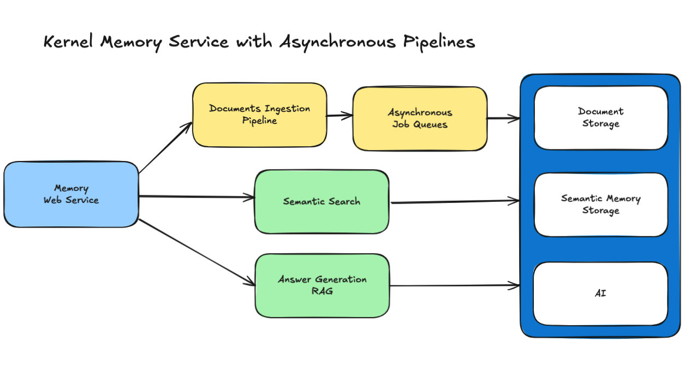
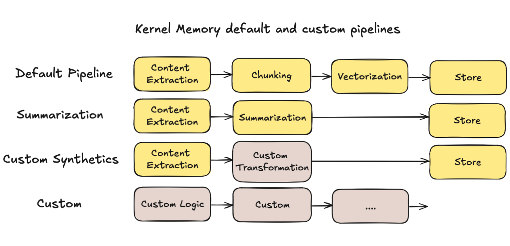

# Kernel Memory

[](https://github.com/microsoft/kernel-memory/blob/main/LICENSE)
[](https://aka.ms/KMdiscord)

This repository presents best practices and a reference implementation for Memory in specific AI and LLMs application
scenarios. Please note that **the code provided serves as a demonstration** and is **not an officially supported**
Microsoft offering.

**Kernel Memory** (KM) is a **multi-modal [AI Service](service/Service/README.md)** specialized in the efficient indexing of datasets through
custom continuous data hybrid pipelines, with support for **[Retrieval Augmented Generation](https://en.wikipedia.org/wiki/Prompt_engineering#Retrieval-augmented_generation)** (RAG),
synthetic memory, prompt engineering, and custom semantic memory processing.

KM is available as a **Web Service**, as a **[Docker container](https://hub.docker.com/r/kernelmemory/service)**, a **[Plugin](https://learn.microsoft.com/copilot/plugins/overview)** for ChatGPT/Copilot/Semantic
Kernel, and as a .NET library for embedded applications.

Utilizing advanced embeddings and LLMs, the system enables Natural Language querying for obtaining answers from the
indexed data, complete with citations and links to the original sources.

Kernel Memory is designed for seamless integration as a Plugin with [Semantic Kernel](https://github.com/microsoft/semantic-kernel), Microsoft Copilot and ChatGPT.


# Memory as a Service - Asynchronous API

Depending on your scenarios, you might want to run all the code **remotely through an asynchronous and scalable service,
or locally inside your process.**



If you're importing small files, and use only .NET and can block the application process while importing documents, 
then local-in-process execution can be fine, using the **MemoryServerless** described below.

However, if you are in one of these scenarios:

- My app is written in **TypeScript, Java, Rust, or some other language**
- I'd just like a web service to import data and send questions to answer
- I'm importing **big documents that can require minutes to process**, and I don't want to block the user interface
- I need memory import to **run independently, supporting failures and retry logic**
- I want to define **custom pipelines mixing multiple languages** like Python, TypeScript, etc

then you're likely looking for a **Memory Service**, and you can deploy Kernel Memory as a backend service, using the
default ingestion logic, or your custom workflow including steps coded in Python/TypeScript/Java/etc., leveraging the
asynchronous non-blocking memory encoding process, uploading documents and asking questions using the **MemoryWebClient**.


[Here](service/Service/README.md) you can find a complete set of instruction about [how to run the Kernel Memory service](service/Service/README.md).

# Kernel Memory on Azure

Kernel Memory can be deployed in various configurations, including as a **Service** in Azure.
To learn more about deploying Kernel Memory in Azure, please refer to the
[Azure deployment guide](https://microsoft.github.io/kernel-memory/azure).
For detailed instructions on deploying to Azure, you can check the [infrastructure documentation](/infra/README.md).

If you are already familiar with these resources, you can quickly deploy by clicking the following button.

[](https://aka.ms/KernelMemoryDeploy2Azure)

# Embedded Memory Component (aka "serverless")

Kernel Memory works and scales at best when running as an asynchronous **Web Service**, allowing to ingest thousands of
documents and information without blocking your app.

However, Kernel Memory can also run in serverless mode, embedding `MemoryServerless` class instance in .NET
backend/console/desktop apps in synchronous mode. 
Each request is processed immediately, although calling clients are responsible for handling transient errors.


> ### Importing documents into your Kernel Memory can be as simple as this:
>
> ```csharp
> var memory = new KernelMemoryBuilder()
>     .WithOpenAIDefaults(Environment.GetEnvironmentVariable("OPENAI_API_KEY"))
>     .Build<MemoryServerless>();
>
> // Import a file
> await memory.ImportDocumentAsync("meeting-transcript.docx", tags: new() { { "user", "Blake" } });
>
> // Import multiple files and apply multiple tags
> await memory.ImportDocumentAsync(new Document("file001")
>     .AddFile("business-plan.docx")
>     .AddFile("project-timeline.pdf")
>     .AddTag("user", "Blake")
>     .AddTag("collection", "business")
>     .AddTag("collection", "plans")
>     .AddTag("fiscalYear", "2023"));
> ```

> ### Asking questions:
>
> ```csharp
> var answer1 = await memory.AskAsync("How many people attended the meeting?");
>
> var answer2 = await memory.AskAsync("what's the project timeline?", filter: new MemoryFilter().ByTag("user", "Blake"));
> ```

The example leverages the default documents ingestion pipeline:

1. Extract text: recognize the file format and extract the information
2. Partition the text in small chunks, to optimize search
3. Extract embedding using an LLM embedding generator
4. Save embedding into a vector index such as
   [Azure AI Search](https://learn.microsoft.com/azure/search/vector-search-overview),
   [Qdrant](https://qdrant.tech/) or other DBs.

In the example, memories are organized by users using tags, safeguarding private information.
Furthermore, memories can be categorized and structured using **tags**, enabling efficient
search and retrieval through faceted navigation.

> ### Data lineage, citations, referencing sources:
>
> All memories and answers are fully correlated to the data provided. When
> producing an answer, Kernel Memory includes all the information needed
> to verify its accuracy:
>
> ```csharp
> await memory.ImportFileAsync("NASA-news.pdf");
>
> var answer = await memory.AskAsync("Any news from NASA about Orion?");
>
> Console.WriteLine(answer.Result + "/n");
>
> foreach (var x in answer.RelevantSources)
> {
>     Console.WriteLine($"  * {x.SourceName} -- {x.Partitions.First().LastUpdate:D}");
> }
> ```
>
> > Yes, there is news from NASA about the Orion spacecraft. NASA has invited the
> > media to see a new test version [......] For more information about the Artemis program,
> > you can visit the NASA website.
> >
> > - **NASA-news.pdf -- Tuesday, August 1, 2023**


# Kernel Memory (KM) and SK Semantic Memory (SM)

**Kernel Memory (KM) is a service** built on the feedback received and lessons learned
from developing Semantic Kernel (SK) and Semantic Memory (SM). It provides several
features that would otherwise have to be developed manually, such as storing files,
extracting text from files, providing a framework to secure users' data, etc.
The KM codebase is entirely in .NET, which eliminates the need to write and maintain
features in multiple languages. As a service, **KM can be used from any language, tool,
or platform, e.g. browser extensions and ChatGPT assistants.**

**Semantic Memory (SM) is a library for C#, Python, and Java** that wraps direct calls
to databases and supports vector search. It was developed as part of the Semantic
Kernel (SK) project and serves as the first public iteration of long-term memory.
The core library is maintained in three languages, while the list of supported
storage engines (known as "connectors") varies across languages.

Here's comparison table:

| Feature                                 | Kernel Memory                                                                                                                                                                                                                                                                                                                                                                                                                                                                                       | Semantic Memory                                                                                              |
|-----------------------------------------|-----------------------------------------------------------------------------------------------------------------------------------------------------------------------------------------------------------------------------------------------------------------------------------------------------------------------------------------------------------------------------------------------------------------------------------------------------------------------------------------------------|--------------------------------------------------------------------------------------------------------------|
| Runtime                                 | Memory as a Service                                                                                                                                                                                                                                                                                                                                                                                                                                                                                 | Vector store library for .NET / Python / Java                                                                |
| Data formats                            | Web pages, PDF, Images, Word, PowerPoint, Excel, Markdown, Text, JSON, HTML                                                                                                                                                                                                                                                                                                                                                                                                                         | Text only                                                                                                    |
| Search                                  | Cosine similarity, Hybrid search, Filters with AND/OR conditions                                                                                                                                                                                                                                                                                                                                                                                                                                    | Cosine similarity. Work in progress to support filters.                                                      |
| Language support                        | Any language, command line tools, browser extensions, low-code/no-code apps, chatbots, assistants, etc.                                                                                                                                                                                                                                                                                                                                                                                             | .NET, Python, Java                                                                                           |
| Storage engines                         | [Azure AI Search](https://azure.microsoft.com/products/ai-services/ai-search), [Elasticsearch](https://www.nuget.org/packages/FreeMindLabs.KernelMemory.Elasticsearch), [MongoDB Atlas](https://www.mongodb.com/atlas/database), [Postgres+pgvector](https://github.com/microsoft/kernel-memory/extensions/postgres), [Qdrant](https://qdrant.tech), [Redis](https://redis.io), [SQL Server](https://www.nuget.org/packages/Microsoft.KernelMemory.MemoryDb.SQLServer/), In memory KNN, On disk KNN. | Azure AI Search, Chroma, DuckDB, Kusto, Milvus, MongoDB, Pinecone, Postgres, Qdrant, Redis, SQLite, Weaviate |
| File storage                            | Disk, [Azure Blobs](https://learn.microsoft.com/azure/storage/blobs/storage-blobs-introduction), [AWS S3](https://aws.amazon.com/s3), [MongoDB Atlas](https://www.mongodb.com/atlas/database), In memory (volatile)                                                                                                                                                                                                                                                                                 | -                                                                                                            |
| RAG                                     | Yes, with sources lookup                                                                                                                                                                                                                                                                                                                                                                                                                                                                            | -                                                                                                            |
| Summarization                           | Yes                                                                                                                                                                                                                                                                                                                                                                                                                                                                                                 | -                                                                                                            |
| OCR                                     | Yes via [Azure Document Intelligence](https://azure.microsoft.com/products/ai-services/ai-document-intelligence)                                                                                                                                                                                                                                                                                                                                                                                    | -                                                                                                            |
| Security Filters                        | Yes                                                                                                                                                                                                                                                                                                                                                                                                                                                                                                 | No                                                                                                           |
| Large document ingestion                | Yes, including async processing using queues ([Azure Queues](https://learn.microsoft.com/azure/storage/queues/storage-queues-introduction), [RabbitMQ](https://www.rabbitmq.com), File based or In memory queues)                                                                                                                                                                                                                                                                                   | -                                                                                                            |
| Document storage                        | Yes                                                                                                                                                                                                                                                                                                                                                                                                                                                                                                 | -                                                                                                            |
| Custom storage schema                   | some DBs                                                                                                                                                                                                                                                                                                                                                                                                                                                                                            | Work in progress                                                                                             |
| Vector DBs with internal embedding      | Yes                                                                                                                                                                                                                                                                                                                                                                                                                                                                                                 | -                                                                                                            |
| Concurrent write to multiple vector DBs | Yes                                                                                                                                                                                                                                                                                                                                                                                                                                                                                                 | -                                                                                                            |
| LLMs                                    | [Azure OpenAI](https://learn.microsoft.com/azure/ai-services/openai/concepts/models), [OpenAI](https://platform.openai.com/docs/models), [Anthropic](https://www.anthropic.com), [Ollama](https://ollama.com), [LLamaSharp](https://github.com/SciSharp/LLamaSharp), [LM Studio](https://lmstudio.ai), Semantic Kernel connectors                                                                                                                                                                   | Azure OpenAI, OpenAI, Gemini, Hugging Face, ONNX, custom ones, etc.                                          |
| LLMs with dedicated tokenization        | Yes                                                                                                                                                                                                                                                                                                                                                                                                                                                                                                 | No                                                                                                           |
| Cloud deployment                        | Yes                                                                                                                                                                                                                                                                                                                                                                                                                                                                                                 | -                                                                                                            |
| Web service with OpenAPI                | Yes                                                                                                                                                                                                                                                                                                                                                                                                                                                                                                 | -                                                                                                            |

## Quick test using the Docker image

If you want to give the service a quick test, use the following command
to **start the Kernel Memory Service** using OpenAI:

```shell
docker run -e OPENAI_API_KEY="..." -it --rm -p 9001:9001 kernelmemory/service
```

on Linux ARM/MacOS

```shell
docker run -e OPENAI_API_KEY="..." -it --rm -p 9001:9001 kernelmemory/service:latest-arm64
```

If you prefer using custom settings and services such as Azure OpenAI, Azure
Document Intelligence, etc., you should create an `appsettings.Development.json`
file overriding the default values set in `appsettings.json`, or using the
configuration wizard included:

    cd service/Service
    dotnet run setup

Then run this command to start the [Docker image](https://hub.docker.com/r/kernelmemory/service)
with the configuration just created:

on Windows:

    docker run --volume .\appsettings.Development.json:/app/appsettings.Production.json -it --rm -p 9001:9001 kernelmemory/service

on Linux (AMD64):

    docker run --volume ./appsettings.Development.json:/app/appsettings.Production.json -it --rm -p 9001:9001 kernelmemory/service

on ARM64 / macOS:

    docker run --volume ./appsettings.Development.json:/app/appsettings.Production.json -it --rm -p 9001:9001 kernelmemory/service:latest-arm64

# Import files using KM web service and `MemoryWebClient`

> ```csharp
> #reference clients/WebClient/WebClient.csproj
>
> var memory = new MemoryWebClient("http://127.0.0.1:9001"); // <== URL where the web service is running
>
> // Import a file (default user)
> await memory.ImportDocumentAsync("meeting-transcript.docx");
>
> // Import a file specifying a Document ID, User and Tags
> await memory.ImportDocumentAsync("business-plan.docx",
>     new DocumentDetails("user@some.email", "file001")
>         .AddTag("collection", "business")
>         .AddTag("collection", "plans")
>         .AddTag("fiscalYear", "2023"));
> ```

# Get answers via the web service

> ```
> curl http://127.0.0.1:9001/ask -d'{"query":"Any news from NASA about Orion?"}' -H 'Content-Type: application/json'
> ```
>
> ```json
> {
>   "Query": "Any news from NASA about Orion?",
>   "Text": "Yes, there is news from NASA about the Orion spacecraft. NASA has invited the media to see a new test version [......] For more information about the Artemis program, you can visit the NASA website.",
>   "RelevantSources": [
>     {
>       "Link": "...",
>       "SourceContentType": "application/pdf",
>       "SourceName": "file5-NASA-news.pdf",
>       "Partitions": [
>         {
>           "Text": "Skip to main content\nJul 28, 2023\nMEDIA ADVISORY M23-095\nNASA Invites Media to See Recovery Craft for\nArtemis Moon Mission\n(/sites/default/files/thumbnails/image/ksc-20230725-ph-fmx01_0003orig.jpg)\nAboard the [......] to Mars (/topics/moon-to-\nmars/),Orion Spacecraft (/exploration/systems/orion/index.html)\nNASA Invites Media to See Recovery Craft for Artemis Moon Miss... https://www.nasa.gov/press-release/nasa-invites-media-to-see-recov...\n2 of 3 7/28/23, 4:51 PM",
>           "Relevance": 0.8430657,
>           "SizeInTokens": 863,
>           "LastUpdate": "2023-08-01T08:15:02-07:00"
>         }
>       ]
>     }
>   ]
> }
> ```

You can find a [full example here](examples/001-dotnet-WebClient/README.md).

# Custom memory ingestion pipelines

On the other hand, if you need a custom data pipeline, you can also customize the steps, which will be handled by your custom business logic:

```csharp
// Memory setup, e.g. how to calculate and where to store embeddings
var memoryBuilder = new KernelMemoryBuilder()
    .WithoutDefaultHandlers()
    .WithOpenAIDefaults(Environment.GetEnvironmentVariable("OPENAI_API_KEY"));

var memory = memoryBuilder.Build();

// Plug in custom .NET handlers
memory.Orchestrator.AddHandler<MyHandler1>("step1");
memory.Orchestrator.AddHandler<MyHandler2>("step2");
memory.Orchestrator.AddHandler<MyHandler3>("step3");

// Use the custom handlers with the memory object
await memory.ImportDocumentAsync(
    new Document("mytest001")
        .AddFile("file1.docx")
        .AddFile("file2.pdf"),
    steps: new[] { "step1", "step2", "step3" });
```



# Web API specs with OpenAI swagger

The API schema is available at http://127.0.0.1:9001/swagger/index.html when
running the service locally with OpenAPI enabled.

# Examples and Tools

## Examples

1. [Collection of Jupyter notebooks with various scenarios](examples/000-notebooks)
2. [Using Kernel Memory web service to upload documents and answer questions](examples/001-dotnet-WebClient)
3. [Importing files and asking question without running the service (serverless mode)](examples/002-dotnet-Serverless)
4. [Using KM Plugin for Semantic Kernel](examples/003-dotnet-SemanticKernel-plugin)
5. Customizations
   * [Processing files with custom logic (custom handlers) in serverless mode](examples/004-dotnet-serverless-custom-pipeline)
   * [Processing files with custom logic (custom handlers) in asynchronous mode](examples/005-dotnet-AsyncMemoryCustomPipeline)
   * [Customizing RAG and summarization prompts](examples/101-dotnet-custom-Prompts)
   * [Custom partitioning/text chunking options](examples/102-dotnet-custom-partitioning-options)
   * [Using a custom embedding/vector generator](examples/103-dotnet-custom-EmbeddingGenerator)
   * [Using custom content decoders](examples/108-dotnet-custom-content-decoders)
   * [Using a custom web scraper to fetch web pages](examples/109-dotnet-custom-webscraper)
   * [Writing and using a custom ingestion handler](examples/201-dotnet-serverless-custom-handler)
   * [Using Context Parameters to customize RAG prompt during a request](examples/209-dotnet-using-context-overrides)
6. Local models and external connectors
   * [Using custom LLMs](examples/104-dotnet-custom-LLM)
   * [Using local LLMs with Ollama](examples/212-dotnet-ollama) 
   * [Using local LLMs with llama.cpp via LlamaSharp](examples/105-dotnet-serverless-llamasharp)
   * [Using local models with LM Studio](examples/208-dotnet-lmstudio)
   * [Using Semantic Kernel LLM connectors](examples/107-dotnet-SemanticKernel-TextCompletion)
   * [Generating answers with Anthropic LLMs](examples/110-dotnet-anthropic)
7. [Upload files and ask questions from command line using curl](examples/006-curl-calling-webservice) 
8. [Summarizing documents, using synthetic memories](examples/106-dotnet-retrieve-synthetics)
9. [Hybrid Search with Azure AI Search](examples/111-dotnet-azure-ai-hybrid-search)
10. [Running a single asynchronous pipeline handler as a standalone service](examples/202-dotnet-custom-handler-as-a-service)
11. [Integrating Memory with ASP.NET applications and controllers](examples/204-dotnet-ASP.NET-MVC-integration)
12. [Sample code showing how to extract text from files](examples/205-dotnet-extract-text-from-docs)
13. [.NET configuration and logging](examples/206-dotnet-configuration-and-logging)
14. [Expanding chunks retrieving adjacent partitions](examples/207-dotnet-expanding-chunks-on-retrieval)
15. [Creating a Memory instance without KernelMemoryBuilder](examples/210-KM-without-builder)
16. [Intent Detection](examples/211-dotnet-WebClient-Intent-Detection)
17. [Fetching data from Discord](examples/301-discord-test-application) 
18. [Test project using KM package from nuget.org](examples/203-dotnet-using-core-nuget)

## Tools

1. [.NET appsettings.json generator](tools/InteractiveSetup)
2. [Curl script to upload files](tools/upload-file.sh)
3. [Curl script to ask questions](tools/ask.sh)
4. [Curl script to search documents](tools/search.sh)
5. [Script to start Qdrant for development tasks](tools/run-qdrant.sh)
6. [Script to start Elasticsearch for development tasks](tools/run-elasticsearch.sh)
7. [Script to start MS SQL Server for development tasks](tools/run-mssql.sh)
8. [Script to start Redis for development tasks](tools/run-redis.sh)
9. [Script to start RabbitMQ for development tasks](tools/run-rabbitmq.sh)
10. [Script to start MongoDB Atlas for development tasks](tools/run-mongodb-atlas.sh)

### .NET packages

- **Microsoft.KernelMemory.WebClient:** .NET web client to call a running instance of Kernel Memory web service.

  [](https://www.nuget.org/packages/Microsoft.KernelMemory.WebClient/)
  [](examples/001-dotnet-WebClient)

- **Microsoft.KernelMemory.Core:** Kernel Memory core library including all extensions, can be used to build custom pipelines and handlers, contains
  also the serverless client to use memory in a synchronous way without the web service.

  [](https://www.nuget.org/packages/Microsoft.KernelMemory.Core/)
  [](examples/002-dotnet-Serverless)

- **Microsoft.KernelMemory.Service.AspNetCore:** an extension to load Kernel Memory into your ASP.NET apps.

  [](https://www.nuget.org/packages/Microsoft.KernelMemory.Service.AspNetCore/)
  [](examples/204-dotnet-ASP.NET-MVC-integration)

- **Microsoft.KernelMemory.SemanticKernelPlugin:** a Memory plugin for Semantic Kernel,
  replacing the original Semantic Memory available in SK.

  [](https://www.nuget.org/packages/Microsoft.KernelMemory.SemanticKernelPlugin/)
  [](examples/003-dotnet-SemanticKernel-plugin)

### Packages for Python, Java and other languages

Kernel Memory service offers a **Web API** out of the box, including the **OpenAPI
swagger** documentation that you can leverage to test the API and create custom
web clients. For instance, after starting the service locally, see http://127.0.0.1:9001/swagger/index.html.

A .NET Web Client and a Semantic Kernel plugin are available, see the nugets packages above.

A python package with a Web Client and Semantic Kernel plugin will soon be available.
We also welcome PR contributions to support more languages.

# Contributors

<!--
githubcontrib --repo kernel-memory --owner microsoft --showlogin true --sortBy login --cols 6 --imagesize 110
-->

[](https://github.com/aaronpowell) |[](https://github.com/afederici75) |[](https://github.com/akordowski) |[](https://github.com/alexibraimov) |[](https://github.com/alkampfergit) |[](https://github.com/amomra) |
:---: |:---: |:---: |:---: |:---: |:---: |
[aaronpowell](https://github.com/aaronpowell) |[afederici75](https://github.com/afederici75) |[akordowski](https://github.com/akordowski) |[alexibraimov](https://github.com/alexibraimov) |[alkampfergit](https://github.com/alkampfergit) |[amomra](https://github.com/amomra) |

[](https://github.com/anthonypuppo) |[](https://github.com/chaelli) |[](https://github.com/cherchyk) |[](https://github.com/coryisakson) |[](https://github.com/crickman) |[](https://github.com/apps/dependabot) |
:---: |:---: |:---: |:---: |:---: |:---: |
[anthonypuppo](https://github.com/anthonypuppo) |[chaelli](https://github.com/chaelli) |[cherchyk](https://github.com/cherchyk) |[coryisakson](https://github.com/coryisakson) |[crickman](https://github.com/crickman) |[dependabot[bot]](https://github.com/apps/dependabot) |

[](https://github.com/dluc) |[](https://github.com/DM-98) |[](https://github.com/EelcoKoster) |[](https://github.com/Foorcee) |[](https://github.com/GraemeJones104) |[](https://github.com/jurepurgar) |
:---: |:---: |:---: |:---: |:---: |:---: |
[dluc](https://github.com/dluc) |[DM-98](https://github.com/DM-98) |[EelcoKoster](https://github.com/EelcoKoster) |[Foorcee](https://github.com/Foorcee) |[GraemeJones104](https://github.com/GraemeJones104) |[jurepurgar](https://github.com/jurepurgar) |

[](https://github.com/JustinRidings) |[](https://github.com/kbeaugrand) |[](https://github.com/koteus) |[](https://github.com/KSemenenko) |[](https://github.com/lecramr) |[](https://github.com/luismanez) |
:---: |:---: |:---: |:---: |:---: |:---: |
[JustinRidings](https://github.com/JustinRidings) |[kbeaugrand](https://github.com/kbeaugrand) |[koteus](https://github.com/koteus) |[KSemenenko](https://github.com/KSemenenko) |[lecramr](https://github.com/lecramr) |[luismanez](https://github.com/luismanez) |

[](https://github.com/marcominerva) |[](https://github.com/neel015) |[](https://github.com/pascalberger) |[](https://github.com/pawarsum12) |[](https://github.com/pradeepr-roboticist) |[](https://github.com/qihangnet) |
:---: |:---: |:---: |:---: |:---: |:---: |
[marcominerva](https://github.com/marcominerva) |[neel015](https://github.com/neel015) |[pascalberger](https://github.com/pascalberger) |[pawarsum12](https://github.com/pawarsum12) |[pradeepr-roboticist](https://github.com/pradeepr-roboticist) |[qihangnet](https://github.com/qihangnet) |

[](https://github.com/roldengarm) |[](https://github.com/setuc) |[](https://github.com/slapointe) |[](https://github.com/slorello89) |[](https://github.com/spenavajr) |[](https://github.com/TaoChenOSU) |
:---: |:---: |:---: |:---: |:---: |:---: |
[roldengarm](https://github.com/roldengarm) |[setuc](https://github.com/setuc) |[slapointe](https://github.com/slapointe) |[slorello89](https://github.com/slorello89) |[spenavajr](https://github.com/spenavajr) |[TaoChenOSU](https://github.com/TaoChenOSU) |

[](https://github.com/teresaqhoang) |[](https://github.com/v-msamovendyuk) |[](https://github.com/Valkozaur) |[](https://github.com/vicperdana) |[](https://github.com/walexee) |[](https://github.com/westdavidr) |
:---: |:---: |:---: |:---: |:---: |:---: |
[teresaqhoang](https://github.com/teresaqhoang) |[v-msamovendyuk](https://github.com/v-msamovendyuk) |[Valkozaur](https://github.com/Valkozaur) |[vicperdana](https://github.com/vicperdana) |[walexee](https://github.com/walexee) |[westdavidr](https://github.com/westdavidr) |

[](https://github.com/xbotter) |
:---: |
[xbotter](https://github.com/xbotter) |
