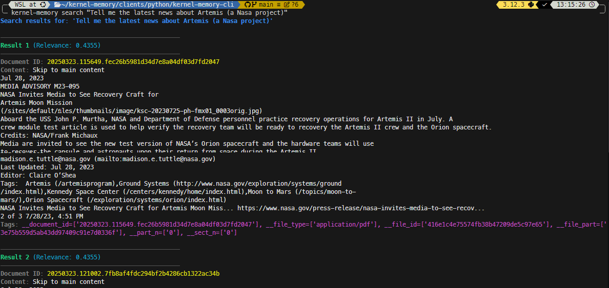

# Kernel Memory CLI

A command line interface for Microsoft Kernel Memory based on python.

## Installation

```bash
pip install kernel-memory-cli
```

## Getting Started

Before using Kernel Memory CLI, you need to configure it:

```bash
kernel-memory config --base-url http://localhost:9001
```

If you need authentication:

```bash
kernel-memory config --base-url http://your-api-url --token your-api-token
```

## Commands

### Configuration

- Set up the CLI:
    ```bash
    kernel-memory config --base-url <url> [--token <token>] [--default-index <index>]
    ```

- View current configuration:
    ```bash
    kernel-memory show
    ```

### Working with Documents

- Upload a document:
    ```bash
    kernel-memory upload <file_path> [--index <index>] [--document-id <id>] [--tags <tag1:value1>]
    ```

- Search document snippets:
    ```bash
    kernel-memory search "your search query" [--index <index>] [--limit 3] [--filter-tags <tag1:value1>]
    ```

- Ask questions:
    ```bash
    kernel-memory ask "your question" [--index <index>] [--filter-tags <tag1:value1>]
    ```

- List available indices:
    ```bash
    kernel-memory list
    ```


## Advanced Usage Examples

### Custom Processing Pipeline

You can customize the document processing pipeline using the `--steps` option when uploading:

```bash
kernel-memory upload --steps extract --steps partition --steps gen_embeddings --steps save_records mydocs-NASA-news.pdf
```

This command uploads a PDF document about NASA news and processes it through these specific pipeline steps:
1. `extract` - Extracts text content from the PDF
2. `partition` - Divides the content into manageable chunks
3. `gen_embeddings` - Generates vector embeddings for each chunk
4. `save_records` - Saves the processed chunks in the index


### Searching for Information

To search for specific information in your documents:

```bash
kernel-memory search "Tell me the latest news about Artemis (a Nasa project)"
```

This command performs a semantic search in your index and returns the most relevant document snippets related to the Artemis project. Each result shows:
- Document ID
- Relevant content snippet
- Relevance score
- Associated tags (if available)



### Asking Questions

For more advanced question answering:

```bash
kernel-memory ask "Tell me the latest news about Artemis (a Nasa project)"
```

Unlike the search command that returns raw snippets, the `ask` command:
1. Retrieves the most relevant information about the Artemis project
2. Generates a comprehensive answer synthesizing the information
3. Provides citations to the source documents
4. Creates a cohesive response that directly answers your question


## Environment Variables

You can configure the CLI using environment variables:

- `KM_BASE_URL` - Base URL for the API
- `KM_TOKEN` - Authentication token
- `KM_TOKEN_PREFIX` - Prefix for the token
- `KM_DEFAULT_INDEX` - Default index to use
- `KM_TIMEOUT` - Request timeout in seconds
- `KM_VERIFY_SSL` - Whether to verify SSL certificates
- `KM_CONFIG_PATH` - Path to config file

## License

[MIT License](LICENSE)