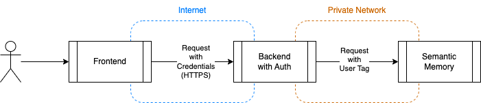

# Semantic Memory F.A.Q.

### How do I integrate Semantic Memory with my application?

There are two main modalities, **As a Service** and **Serverless**, plus
customizations you can apply.

Running Semantic Memory as a Service allows you to **interact with the memory
via HTTP, in any language**. The repo contains a Memory Web client written in
C# and some examples showing how to do the same from command line with `curl`.
We will provide soon Web clients written in other languages. Semantic Memory
Service is designed to run as an internal service, behind your backend,
similarly to a DB, so you should not expose the service to public traffic
without having your authentication in front, similar to how design a typical
backend integrated with a SQL server, Service Bus, etc.
One important benefit of the service, it's designed to scale horizontally and
with **durable queues for long-running operations**.
See the [service documentation](../dotnet/Service/README.md) for more details.
[Here](../examples/002-dotnet-WebClient/README.md) you can find an example
showing the web client.

Alternatively, you can **embed Semantic Memory directly into your C#
applications**, using the **Serverless Memory client**. This is limited to
.NET applications and doesn't allow mixing .NET pipelines with other languages,
e.g. pipeline handlers written in Python or TypeScript. The serverless approach
can be very useful for console applications, tests and demos. **The API is the
same** API offered by the service, so it's possible to switch from Service to
Serverless changing only the memory client instance.
[Here](../examples/001-dotnet-Serverless/README.md) you can find an example
showing the serverless client.


### How do I protect users information, e.g. isolating data and making sure users cannot access reserved information?

In order to protect users data, you should follow these design principles:

* Use Semantic Memory as **a private backend component**, similar to a SQL
  Server, without granting direct access.
* Authenticate your users in your backend using a secure solution like Azure
  Active Directory, extract the user ID from the signed credentials like JWT
  tokens or client certs.
* **Use Semantic Memory Tags as Security Filters**. See
  [Security Filters](SECURITY_FILTERS.md) for more details.



### Is it possible to download web pages and turn the content into memory? Can I ask questions about the content of a web page?

Yes, the memory API includes a `ImportWebPageAsync` method that can be used
to take a web page content, and process the text content like files. Once
the content is imported, asking questions is very simple:

```csharp
var docId = await memory.ImportWebPageAsync("https://raw.githubusercontent.com/microsoft/semantic-memory/main/README.md");

var answer = await memory.AskAsync("Where can I store my semantic memory records?", MemoryFilters.ByDocument(docId));
```


### I've stored several documents in memory, how can I target a question to a specific document, getting answers grounded only on the selected doc?

When uploading a file (or multiple files), you can specify a document ID,
or you can let the service generate a document ID for you. You will see these
Document IDs also when getting answers. When sending a question, it's
possible to **include a filter**, so it's possible to filter by tags and
**by document ID**. Here's an example:

```csharp
string docId = await memory.ImportDocumentAsync("manual.pdf");

await memory.ImportDocumentAsync("Europe.docx", documentId: "europe001");
```

In the first example ("manual.pdf"), the system will generate a new Document ID
every time the code is executed, and `docId` will contain the value, that you
can save and use for questions.

In the second example ("book.docx"), the document ID is fixed, chosen by the
client.

And this is the code showing how to ask a questions using only a specific document:

```csharp
var answer1 = await memory.AskAsync("What's the produc name?", MemoryFilters.ByDocument(docId));

var answer2 = await memory.AskAsync("What's the total population?", MemoryFilters.ByDocument("europe001"));
```


