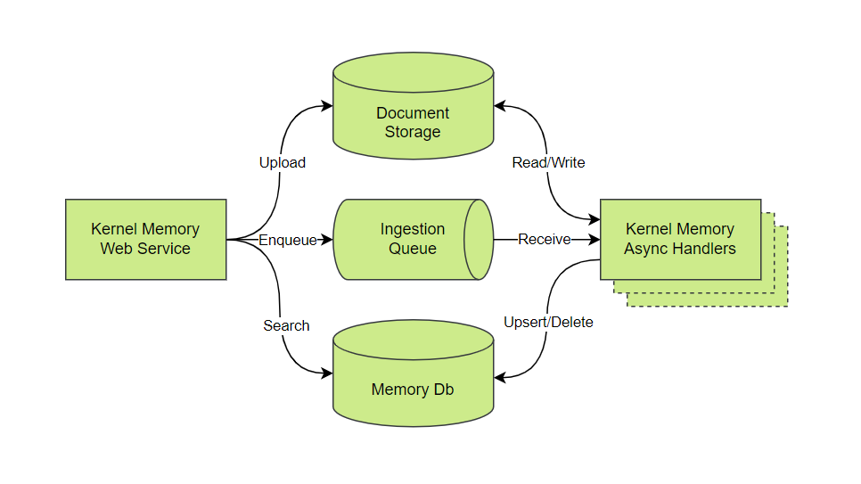
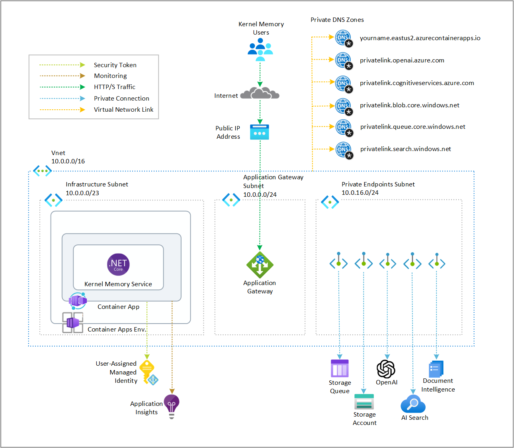

# Azure Infrastructure Architecture

This section explains the infrastructure of Kernel Memory in Azure, which implements an asynchronous microservices architecture.

## Components of the Kernel Memory Architecture

The diagram illustrates the components of the Kernel Memory infrastructure in Azure and their interactions.

#### Kernel Memory Web Service

- **Function**: Acts as the entry point for data ingestion. It receives data through an API and processes user queries.
- **Operations**:
  - **Upload**: Sends data to Document Storage.
  - **Enqueue**: Sends data to the Ingestion Queue.
  - **Search**: Queries data from the Memory Database.

#### Document Storage

- **Service**: Azure Blob Storage.
- **Function**: Stores the raw documents uploaded by the Web Service.
- **Operations**:
  - **Read/Write**: Kernel Memory Async Handlers read from and write to Document Storage as they process the data.

#### Ingestion Queue

- **Service**: Azure Storage Queue.
- **Function**: Manages the flow of data between the Web Service and the Async Handlers. It temporarily holds the data before processing.
- **Operations**:
  - **Enqueue**: Web Service adds data to the queue.
  - **Receive**: Kernel Memory Async Handlers retrieve data from the queue for processing.

#### Kernel Memory Async Handlers

- **Function**: Process the data retrieved from the Ingestion Queue. This includes extracting information and transforming it as needed.
- **Operations**:
  - **Read/Write**: Access Document Storage for reading raw documents and writing processed data.
  - **Upsert/Delete**: Update or delete entries in the Memory Database based on the processed data.

#### Memory Database (Memory Db)

- **Service**: Azure AI Search.
- **Function**: Stores the processed data, making it searchable and accessible for queries.
- **Operations**:
  - **Upsert/Delete**: Kernel Memory Async Handlers update or remove data entries.
  - **Search**: Web Service queries the database to retrieve processed information for user requests.

### Overview

The Web Service receives data through an API and stores it in Azure Blob Storage.
Kernel Memory Async Handlers then process the data, which is subsequently stored in Azure AI Search.
Finally, the data can be queried by the Web Service

For the Kernel Memory Web Service and Kernel Memory Async Handlers, we use Azure Container Apps to pull Docker images from Docker Hub.
The current architecture employs the `Consumption` ACA deployment type.
For production deployments, we recommend using the `Dedicated` deployment type.
Azure Container Apps are deployed with a public endpoint protected by an API key.

{: .highlight }
It's important to note that the Kernel Memory Web Service and Kernel Memory Async Handlers can also be deployed using
Azure App Service, Azure Kubernetes Service, Azure Container Instances, or Azure Virtual Machines.

Kernel Memory Async Handlers use Azure AI Document Intelligence to extract content from images. Local authentication is disabled in favor of Managed Identity.

An Azure Managed Identity is created and assigned to the Azure Container Apps to access Azure Blob Storage and Azure AI Search.
This Managed Identity is also used to access other resources required by the Kernel Memory Web Service and Kernel Memory Async Handlers.

Azure Blob Storage is used for document storage.
Data is stored in Blob Storage and, after processing by the Kernel Memory Async Handlers, is stored in Azure AI Search for querying by the Web Service.
The architecture uses Standard Locally Redundant Storage (SKU Standard_LRS) for redundancy in the primary region.
For security, the Storage Account does not use access keys and relies on Managed Identity for access.

The architecture uses Azure Storage Queue for queuing. The Web Service sends data to the queue, and the Kernel Memory Async Handlers retrieve data from it.
{: .highlight }
It's important to note that orchestration can also be achieved using RabbitMQ.

As a Vector DB, this architecture uses Azure AI Search. Kernel Memory can also be configured to work with Qdrant, Postgres, Redis, SimpleVectorDb, or SQL Server.
Access to Azure AI Search, like other services, is protected with Managed Identity.

For AI models, this architecture leverages models deployed in Azure AI.
The text-embedding-ada-002 version `2` is used for embedding, and the `gpt-35-turbo-16k` deployment version `0613` is used for inference.
Model names and versions are specified in the `infra/main.bicep` file.

All resources are deployed in the same Azure Resource Group and the region.

## Cost

When you deploy Kernel Memory in Azure, you will incur costs associated with the resources it uses.

{: .highlight }
It's important to understand the costs of your Kernel Memory deployment in Azure, as Azure resource usage is billed based on the resources consumed.

### Microsoft Azure Estimate

The following approximate estimate was generated using the Azure Pricing Calculator. You can review the estimate for the proposed architecture on the [Azure Pricing Calculator](https://azure.com/e/f2706987b1e24aae93225b204d8dc7fd).

{: .highlight }
To minimize costs while testing Kernel Memory on Azure, delete resources after use. Please note that all uploaded data will be lost upon deletion.

| Service category      | Service type                   | Region            | Description                                                                                                                                                                                                                                                                                                                    | Estimated monthly cost |
| --------------------- | ------------------------------ | ----------------- | ------------------------------------------------------------------------------------------------------------------------------------------------------------------------------------------------------------------------------------------------------------------------------------------------------------------------------ | ---------------------- |
| AI + machine learning | Azure OpenAI Service           | East US           | Embedding Models, Text-Embedding-3-Small, 2,000 x 1,000 Tokens                                                                                                                                                                                                                                                                 | $0.04                  |
| AI + machine learning | Azure OpenAI Service           | East US           | Language Models, GPT-3.5-Turbo-0125-16K, 5,000 x 1,000 input tokens, 2,000 x 1,000 output tokens                                                                                                                                                                                                                               | $5.50                  |
| AI + machine learning | Azure AI Document Intelligence | East US           | Azure Form Recognizer, Pay as you go, S0: 1 x 1,000 Custom pages, 0 x 1,000 Pre-built pages, 1 x 1,000 Read pages, 0 x 1,000 Add-on pages, 0 x 1,000 Query pages                                                                                                                                                               | $52.50                 |
| Web                   | Azure AI Search                | East US           | Basic, 1 Unit(s), 1 Month                                                                                                                                                                                                                                                                                                      | $73.73                 |
| Containers            | Azure Container Apps           | East US           | Consumption Plan Type, 10 million requests per month, Pay as you go, 20 concurrent requests per container app, 100 milliseconds execution time per request, 2 vCPUs, 1 GiB memory, Pay as you go                                                                                                                               | $3.20                  |
| Storage               | Storage Accounts               | East US           | Block Blob Storage, General Purpose V2, Flat Namespace, LRS Redundancy, Hot Access Tier, 10 GB Capacity - Pay as you go, 10 x 10,000 Write operations, 10 x 10,000 List and Create Container Operations, 10 x 10,000 Read operations, 1 x 10,000 Other operations. 1,000 GB Data Retrieval, 1,000 GB Data Write, SFTP disabled | $1.25                  |
| Storage               | Storage Accounts               | East US           | Queue Storage, General Purpose V2, LRS Redundancy, 1 GB Capacity, 1,000 Queue Class 1 operations, 1,000 Queue Class 2 operations                                                                                                                                                                                               | $8.05                  |
| Networking            | Virtual Network                | East US           | East US (Virtual Network 1): 100 GB Outbound Data Transfer; East US (Virtual Network 2): 100 GB Outbound Data Transfer                                                                                                                                                                                                         | $4.00                  |
| Networking            | Azure Private Link             | East US           | 5 Private Links X 1 Endpoint X 730 Hours, 10 GB Outbound data processed, 10 GB Inbound data processed                                                                                                                                                                                                                          | $37.50                 |
| Networking            | Azure DNS                      | East US           | 5 Private DNS records X Zone 1, DNS, Public; 0 hosted DNS zones, 0 DNS queries                                                                                                                                                                                                                                                 | $0.0                   |
| Networking            | Application Gateway            | East US           | Basic tier, Small Instance size: 1 Gateway hours instance(s) x 730 Hours, 0 GB Data processed unit(s), 5 GB Zone unit(s)                                                                                                                                                                                                       | $18.25                 |
| Networking            | IP Addresses                   | East US           | Basic (Classic), 0 Dynamic IP Addresses X 730 Hours, 1 Static IP Addresses X 1 Month                                                                                                                                                                                                                                           | $2.63                  |
| Support               |                                | Support           |                                                                                                                                                                                                                                                                                                                                | $0.00                  |
|                       |                                | Licensing Program | Microsoft Customer Agreement (MCA)                                                                                                                                                                                                                                                                                             |                        |
|                       |                                | Total             |                                                                                                                                                                                                                                                                                                                                | $186.64                |

_All prices shown are in United States – Dollar ($) USD. This is a summary estimate, not a quote. For up to date pricing information please visit https://azure.microsoft.com/pricing/calculator/
This estimate was created on 6/24/2024 2:41:50 PM UTC._

### Next steps

Follow the [deployment](./deployment) to deploy Kernel Memory in Azure as well as the [usage](./usage) guide to understand how to use Kernel Memory in Azure.
