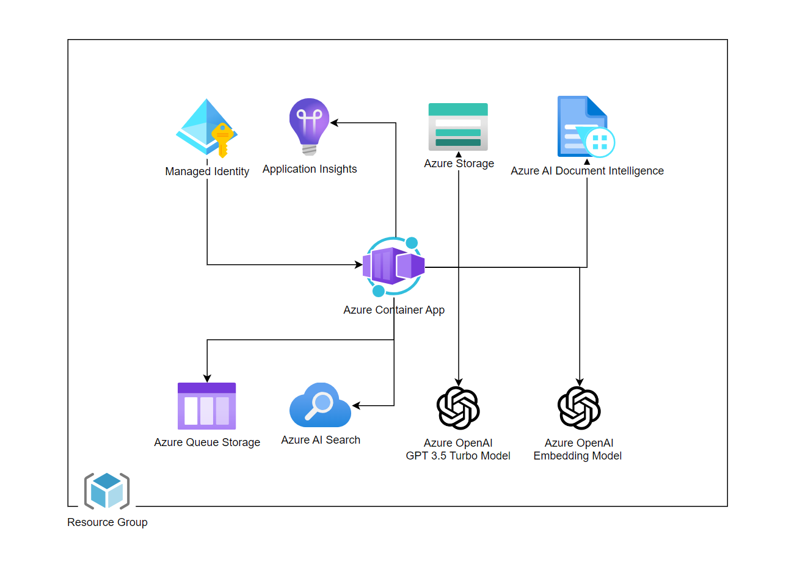

# Azure Infrastacture Architecture

Infrastracture of Kernel Memory in Azure explained in this section implements [asynchronous microservices architecture](../#memory-as-a-service---asynchronous-api).

The idea is that Web Service accepts data via API and stores it in the Azure Blob Storage. The data is then processed by Kernel Memory Async Handers and stored in the Azure AI Search. The data is then available for the Web Service to be queried.

For Kernel Memory Web Service and Kernel Memory Async Handlers, we use Azure Container Apps that pull the Docker images from the [Docker Hub](https://hub.docker.com/r/kernelmemory/service). The current architecture utilizes the `Consumption` [ACA deployment type](https://learn.microsoft.com/en-us/azure/container-apps/environment#types). For production deployments, it is recommended to use the `Dedicated` deployment type. Azure Container Apps are deployed with a public endpoint that is protected with an API key.
{: .highlight }
It's important to understand the deployment of Kernel Memory Web Service and Kernel Memory Async Handlers could alse be done in [Azure App Service](https://azure.microsoft.com/products/app-service)
, [Azure Kubernetes Service](https://azure.microsoft.com/products/kubernetes-service), [Azure Container Instances](https://azure.microsoft.com/products/container-instances) or even in [Azure Virtual Machines](https://azure.microsoft.com/products/virtual-machines).

Kernel Memory Async Handlers use [Azure AI Document Intelligence](https://azure.microsoft.com/products/ai-services/ai-document-intelligence) to extract content from images. Local Auth is disabled and managed Identity is used intestead.

Azure Manadged Identity is created and assigned to the Azure Container Apps to access the Azure Blob Storage and Azure AI Search. The Managed Identity is used to access other resources required by the Kernel Memory Web Service and Kernel Memory Async Handlers.

Document Storage type is [Azure Blob Storage](https://azure.microsoft.com/products/storage/blobs). The data is stored in the Blob Storage. After processing by the Kernel Memory Async Handlers, the data is stored in Azure AI Search, making it accessible for querying by the Web Service. Architecture used Standard Locally Redundant Storage (SKU Standard_LRS). This SKU is for [Standard storage type](https://learn.microsoft.com/azure/storage/common/storage-account-overview) with [redundancy in the primary region
](https://learn.microsoft.com/azure/storage/common/storage-redundancy#redundancy-in-the-primary-region). For security reasong Storage Account does not use access keys and relies on Managed Identity for access.

Queue Type is [Azure Storage Queue](https://azure.microsoft.com/products/storage/queues). Architecture leverages the Azure Storage Account deployed for storing files. The Web Service sends the data to the Queue and the Kernel Memory Async Handlers pick up the data from the Queue.
{: .highlight }
It's important to understand the orchestration could also be acheaved by leveraging [RabbitMQ]().

As a Vector DB this architecture uses [Azure AI Search](https://azure.microsoft.com/products/ai-services/ai-search). Kernel Memory could also be configured to work with Qdrant, Postgres, Redis, SimpleVectorDb or SqlServer. Similarly to other services, access to Azure AI Search is protected with Managed Identity.

For the AI models used by Kernel Memory, this architecture leverages models deployed in Azure AI. The `text-embedding-ada-002` version `2` is used for embedding, and the `gpt-35-turbo-16k` deployment version `0613` is used for inference. The model names and versions are specified in the `infra/main.bicep` file.

All resources are deployed in the same Azure Resource Group. The resources are deployed in the same region.

## Cost

When you deploy Kernel Memory in Azure, you will incur costs associated with the resources it uses.

{: .highlight }
It's important to understand the cost of your Kernel Memory deployment in Azure. Azure resource usage is billed based on the resources you use.

### Microsoft Azure Estimate

[Pricing calculator](https://azure.microsoft.com/en-us/pricing/calculator/) was used for the following approximate estimate.

{: .highlight }
While trying Kernel Memory on Azure you can minimize cost when you delete resource after usage. All aploaded data will be lost.

| Service category      | Service type                   | Region            | Description                                                                                                                                                                                                                                                                                                                    | Estimated monthly cost |
| --------------------- | ------------------------------ | ----------------- | ------------------------------------------------------------------------------------------------------------------------------------------------------------------------------------------------------------------------------------------------------------------------------------------------------------------------------ | ---------------------- |
| AI + machine learning | Azure OpenAI Service           | East US           | Embedding Models, Text-Embedding-3-Small, 2,000 x 1,000 Tokens                                                                                                                                                                                                                                                                 | $0.04                  |
| AI + machine learning | Azure OpenAI Service           | East US           | Language Models, GPT-3.5-Turbo-0125-16K, 5,000 x 1,000 input tokens, 2,000 x 1,000 output tokens                                                                                                                                                                                                                               | $5.50                  |
| AI + machine learning | Azure AI Document Intelligence | West US           | Azure Form Recognizer, Pay as you go, S0: 1 x 1,000 Custom pages, 0 x 1,000 Pre-built pages, 1 x 1,000 Read pages, 0 x 1,000 Add-on pages, 0 x 1,000 Query pages                                                                                                                                                               | $52.50                 |
| Web                   | Azure AI Search                | East US           | Basic, 1 Unit(s), 1 Month                                                                                                                                                                                                                                                                                                      | $73.73                 |
| Containers            | Azure Container Apps           | East US           | Consumption Plan Type, 10 million requests per month, Pay as you go, 20 concurrent requests per container app, 100 milliseconds execution time per request, 2 vCPUs, 1 GiB memory, Pay as you go                                                                                                                               | $3.20                  |
| Storage               | Storage Accounts               | East US           | Block Blob Storage, General Purpose V2, Flat Namespace, LRS Redundancy, Hot Access Tier, 10 GB Capacity - Pay as you go, 10 x 10,000 Write operations, 10 x 10,000 List and Create Container Operations, 10 x 10,000 Read operations, 1 x 10,000 Other operations. 1,000 GB Data Retrieval, 1,000 GB Data Write, SFTP disabled | $1.25                  |
| Storage               | Storage Accounts               | East US           | Queue Storage, General Purpose V2, LRS Redundancy, 1 GB Capacity, 1,000 Queue Class 1 operations, 1,000 Queue Class 2 operations                                                                                                                                                                                               | $8.05                  |
| Support               |                                | Support           |                                                                                                                                                                                                                                                                                                                                | $0.00                  |
|                       |                                | Licensing Program | Microsoft Customer Agreement (MCA)                                                                                                                                                                                                                                                                                             |                        |
|                       |                                | Total             |                                                                                                                                                                                                                                                                                                                                | $144.27                |

_All prices shown are in United States – Dollar ($) USD. This is a summary estimate, not a quote. For up to date pricing information please visit https://azure.microsoft.com/pricing/calculator/
This estimate was created at 6/24/2024 2:41:50 PM UTC._

### Next steps

Follow the [deployment](./deployment) to deploy Kernel Memory in Azure as well as the [usage](./usage) guide to understand how to use Kernel Memory in Azure.
