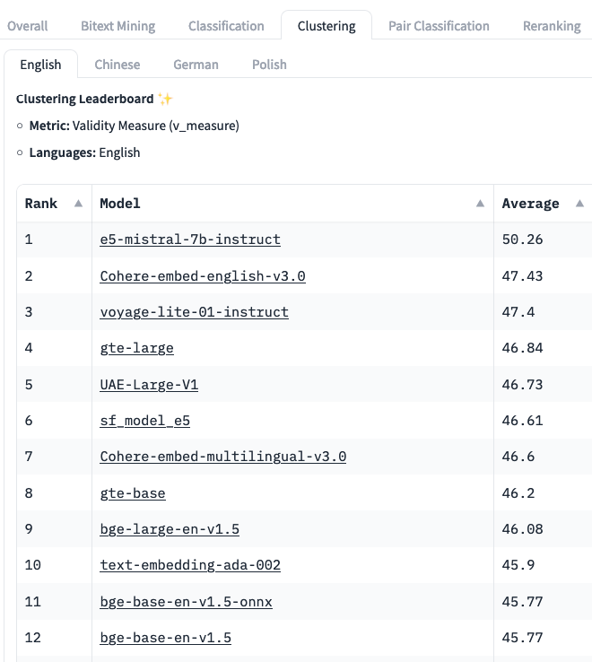

# Embedding

Although in use for quite some time, embeddings have become more popular since the
launch of GPT-3 thanks to OpenAI LLMs ability to accurately capture the "similarity"
of sentences, even across different languages.

For instance, using embeddings and [cosine similarity](cosine-similarity), LLMs can infer that
"*the sun is a star*", "*the moon is a satellite*" and "*la Terre est un corps céleste*"
are three sentences with a lot in common, they are "close", while a sentence like
"*fire is a form of energy*" is less similar instead, less _close_.

Embeddings are a powerful tool for software developers working with artificial intelligence
and natural language processing. They allow computers to understand the meaning of
words in a more sophisticated way, by representing them as high-dimensional vectors
rather than simple strings of characters. Embeddings come in the form of **numerical
vectors**, e.g. a list of **hundreds of floating numbers**, that KM stores in vector DBs
such as Azure AI Search, Qdrant, PostgreSQL, etc.

Embeddings work by splitting each word in smaller "tokens", and mapping each known token 
in a vocabulary to a point in a **high-dimensional space**.
This space and the token vocabulary are designed so that **words with similar meanings are
located near each other**.
This allows algorithms to identify relationships between words, such as synonyms or antonyms,
without needing explicit rules or human supervision.

One important aspect to consider is that for a given sentence, each LLM produces different
embeddings, that are not compatible across AI models. So for instance, embeddings generated
by OpenAI Ada cannot be compared with those generated by Mistral, Cohere, etc.
Also, LLMs' ability to extract meaning and detect similarity varies a lot from model to model,
and **some embeddings should not be used for text comparison**, to avoid incoherent results.

Consider looking at [Hugging Face Massive Text Embedding Benchmark (MTEB)](https://huggingface.co/spaces/mteb/leaderboard)
to discover a list of suitable models, e.g. the Clustering table shows how well models
can group similar sentences and paragraphs. We recommend starting with **OpenAI Ada2** ("text-embedding-ada-002"),
currently at position #10 on MTEB, because it's easy to setup and works well across multiple
languages. 

> 
>
> [_MTEB leaderboard, Clustering, January 2024._]

One popular method for creating embeddings is
Word2Vec [[1]](https://arxiv.org/abs/1301.3781)[[2]](https://arxiv.org/abs/1310.4546),
which uses neural networks to learn the relationships between words from large amounts
of text data. Other methods include GloVe and
[FastText](https://research.facebook.com/downloads/fasttext/). These methods
all have different strengths and weaknesses, but they share the common goal of creating
meaningful representations of words that can be used in machine learning models.

Embeddings can be used in many different applications, including sentiment analysis,
document classification, and recommendation systems. They are particularly useful
when working with unstructured text data where traditional methods like bag-of-words
models struggle, and are a fundamental part of Kernel Memory.

Kernel Memory attempts to emulate how the human brain stores and retrieves knowledge about
the world. Embeddings are used to create a semantic map by **representing concepts
or entities as vectors in a high-dimensional space**. This approach allows KM
to learn relationships between concepts and make inferences based on similarity or
distance between vector representations.

Software developers can use pre-trained embedding model, or train their one with their
own custom datasets. Pre-trained embedding models have been trained on large amounts
of data and can be used out-of-the-box for many applications. Custom embedding models
may be necessary when working with specialized vocabularies or domain-specific language.

Overall, embeddings are an essential tool for software developers working with AI
and natural language processing. They provide a powerful way to represent and understand
the meaning of words in a computationally efficient manner.

## Applications

Some examples about embeddings applications.

1. Generative Memory: Embeddings can be used to store memory and generate content,
   by which a machine can learn to understand the meanings of words and sentences,
   can understand the relationships between them and synthesize new content.

2. Natural Language Processing (NLP): Embeddings can be used to represent words or
   sentences in NLP tasks such as sentiment analysis, named entity recognition, and
   text classification.

3. Recommender systems: Embeddings can be used to represent the items in a recommender
   system, allowing for more accurate recommendations based on similarity between items.

4. Image recognition: Embeddings can be used to represent images in computer vision
   tasks such as object detection and image classification.

5. Anomaly detection: Embeddings can be used to represent data points in high-dimensional
   datasets, making it easier to identify outliers or anomalous data points.

6. Graph analysis: Embeddings can be used to represent nodes in a graph, allowing
   for more efficient graph analysis and visualization.

7. Personalization: Embeddings can be used to represent users in personalized recommendation
   systems or personalized search engines.

## Vector Operations used with Embeddings

 - [Cosine Similarity](cosine-similarity)
 - [Dot Product](dot-product)
 - [Euclidean Distance](euclidean-distance)
