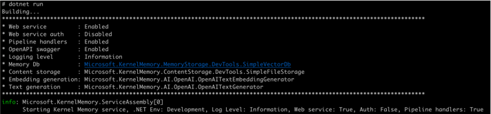
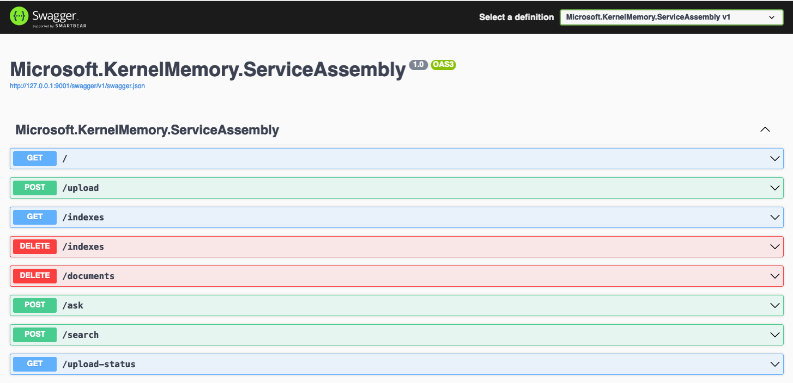
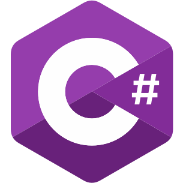

# Quickstart, local deployment

This guide assumes you're familiar with web services, docker and OpenAI settings.

In this quickstart tour, we'll start the service and try the Memory API from a Bash command line
and a .NET application.

## Requirements

* [.NET 6+](https://dotnet.microsoft.com/download)
* Either an [OpenAI API Key](https://platform.openai.com/api-keys) or
  [Azure OpenAI deployment](https://azure.microsoft.com/products/ai-services/openai-service). If you are familiar
  with llama.cpp or LLamaSharp you can also use a LLama model, although in that case the AI code will be
  considerably slower, depending on your device.
* A vector DB, such as Azure AI Search, Qdrant, or Postgres. You can also use KM SimpleVectorDb for basic tests.
* A copy of [KM repository](https://github.com/microsoft/kernel-memory).

## Configuration

KM service requires a configuration file to start, usually `appsettings.development.json` when working locally,
or `appsettings.production.json` when running in Production environment. The exact config file is automatically
loaded, by checking the `ASPNETCORE_ENVIRONMENT` environment variable.

KM repository includes a wizard to quickly generate your first `appsettings.development.json`:

    cd service/Service
    dotnet run setup

Follow the questions on screen to create/edit the file. You can run the command multiple times if necessary.

{: .console }
> _Run the web service (upload and search endpoints)_? **YES**
>
> _Protect the web service with API Keys_? **NO**
> ------ you can leave this off for this test
>
> _Enable OpenAPI swagger doc at /swagger/index.html_? **YES**
>
> _Run the .NET pipeline handlers as a service_? **YES**
>
> _How should memory ingestion be orchestrated_? **Using asynchronous distributed queues**
>
> _Which queue service will be used_? **SimpleQueues**
> ------ this will use volatile queues in memory, suitable only for tests
>
>       Directory where to store queue messages: _tmp_queues
>
> _Where should the service store files_? **SimpleFileStorage**
> ------ this will use volatile storage in memory, suitable only for tests. You can manually edit appsettings.development.json to persist files on disk.
>
>       Directory where to store files: _tmp_files
>
> _Which service should be used to extract text from images_? **None**
>
> _When importing data, generate embeddings_? **YES**
>
> _When searching for text and/or answers, which embedding generator should be used_? **Azure OpenAI or OpenAI**
>
>       OpenAI <text/chat model name> [current: gpt-3.5-turbo-16k]:      Press ENTER to use default
>       OpenAI <embedding model name> [current: text-embedding-ada-002]: Press ENTER to use default
>       OpenAI <API Key>: sk-*********************************
>
> _When searching for answers, which memory DB service contains the records?_ **SimpleVectorDb**
> ------ this will use volatile storage in memory, suitable only for tests. You can manually edit
appsettings.development.json to persist files on disk, or choose one of the available options suggested.
>
>       Directory where to store vectors: _tmp_vectors
>
> _When generating answers and synthetic data, which LLM text generator should be used?_ **Azure OpenAI or OpenAI**
>
> _Log level_? **Information**

Great! If you completed the wizard, you should be ready to start the service and run the examples below. 

{: .important }
> * If you selected any of the "simpleXYZ" dependency, then data will be stored in memory only, and automatically discarded
>   when the service stops. Edit the configuration file manually to persist  data on disk. [More information here](service/configuration).
> * The configuration wizard uses some default settings that you might want to change. After running the examples, take
>   a look at the included [appsettings.json](https://github.com/microsoft/kernel-memory/blob/main/service/Service/appsettings.json)
>   to see all the available options, and read the [Service Configuration doc](service/configuration) for more information.

## Start the service

    cd service/Service
    dotnet run

You should see something similar in your console:



## Check OpenAPI swagger

In your browser open [http://127.0.0.1:9001/swagger/index.html](http://127.0.0.1:9001/swagger/index.html)

You should see the usual Swagger UI:



#  Python

## Upload a document

The following script performs the same operation, uploading a file:

```python
import requests

files = {
    "file1": ("README.md", open("README.md", "rb")),
}

data = {
    "documentId": "doc01",
}

response = requests.post("http://127.0.0.1:9001/upload", files=files, data=data)

print(response.text)
```

## Query

```python
import requests
import json

data = {"question": "Name one tool that I can use from command line"}

response = requests.post(
    "http://127.0.0.1:9001/ask",
    headers={"Content-Type": "application/json"},
    data=json.dumps(data),
).json()

if "text" in response:
    print(response["text"])
else:
    print("Response does not contain a 'text' property.")
```

If you run the scripts, the output will look similar to:

{: .console }
> _You can use the "upload-file.sh", "ask.sh", and "search.sh" tools from the command line._

#  C#

## Upload a document and answer questions

Create a new .NET Console app and add package `Microsoft.KernelMemory.WebClient`, then add this code:

```csharp
using Microsoft.KernelMemory;

var memory = new MemoryWebClient("http://127.0.0.1:9001/");

await memory.ImportWebPageAsync(
    "https://raw.githubusercontent.com/microsoft/kernel-memory/main/README.md",
    documentId: "doc02");

Console.WriteLine("Waiting for memory ingestion to complete...");
while (!await memory.IsDocumentReadyAsync(documentId: "doc02"))
{
    await Task.Delay(TimeSpan.FromMilliseconds(1500));
}

var answer = await memory.AskAsync("Is there a Kernel Memory community and how can I join?");

Console.WriteLine($"\nAnswer: {answer.Result}");
```

Run the application, and you should see:

{: .console }
> Answer: Yes, there is a Kernel Memory community. You can join the community by joining
> the [Kernel Memory Discord server](https://aka.ms/KMdiscord).

# Command line (bash, curl)

## Upload a document

Open a Bash console in the folder where you cloned Kernel Memory repository. The repository contains
a **tools** folder with a few scripts, in particular `upload-file.sh` and `ask.sh` that you can use to send
requests to the web service. You can also use `curl` if you prefer, the syntax is pretty simple, and the web service
replies with JSON.

Run the following commands:

    cd tools
    ./upload-file.sh -f README.md -i doc01 -s http://127.0.0.1:9001

or:

    curl -F 'file1=@"README.md"' -F 'documentId="doc01"' http://127.0.0.1:9001/upload

You should see a confirmation message:

{: .console }
> ```json
> {"index":"","documentId":"doc01","message":"Document upload completed, ingestion pipeline started"}
> ```

## Query

    cd tools
    ./ask.sh -q "Can I use KM from command line?" -s http://127.0.0.1:9001

or:

    curl -d'{"question":"Can I use KM from command line?"}' -H 'Content-Type: application/json' http://127.0.0.1:9001/ask

The script will show the JSON returned by the web service, and among other details you should see the answer:

{: .console }
> _Yes, you can use Kernel Memory (KM) from the command line. There are several scripts provided, such
as `upload-file.sh`,
> `ask.sh`, and `search.sh`, that allow you to interact with KM from the command line. These scripts provide
functionality
> for uploading files, asking questions about your documents, and searching your indexed documents, respectively.
> Additionally, there is a script called `run-qdrant.sh` that starts Qdrant, which is used to store and search vectors
in KM._

#  Java

## Upload a document

Create a `FileUploadExample.java` file, with this code:

```java
import java.io.*;
import java.net.HttpURLConnection;
import java.net.URL;
import java.nio.charset.StandardCharsets;
import java.nio.file.Files;

public class FileUploadExample {

  public static void main(String[] args) throws IOException {
    String url = "http://127.0.0.1:9001/upload";
    String filename = "README.md";
    String documentId = "doc01";

    // Set up the file and form data
    File file = new File(filename);
    String boundary = "----WebKitFormBoundary" + Long.toHexString(System.currentTimeMillis());
    String CRLF = "\r\n";
    String charset = StandardCharsets.UTF_8.name();

    // Create the HTTP connection
    HttpURLConnection connection = (HttpURLConnection) new URL(url).openConnection();
    connection.setDoOutput(true);
    connection.setRequestMethod("POST");
    connection.setRequestProperty("Content-Type", "multipart/form-data; boundary=" + boundary);

    // Write the request body
    try (OutputStream output = connection.getOutputStream();
        PrintWriter writer = new PrintWriter(new OutputStreamWriter(output, charset), true)) {
      // Add file data
      writer.append("--" + boundary).append(CRLF);
      writer.append("Content-Disposition: form-data; name=\"file1\"; filename=\"" + file.getName() + "\"").append(CRLF);
      writer.append("Content-Type: " + Files.probeContentType(file.toPath())).append(CRLF); // Use probeContentType
      writer.append(CRLF).flush();
      Files.copy(file.toPath(), output);
      output.flush();
      writer.append(CRLF).flush();

      // Add form data
      writer.append("--" + boundary).append(CRLF);
      writer.append("Content-Disposition: form-data; name=\"documentId\"").append(CRLF);
      writer.append(CRLF).append(documentId).append(CRLF).flush();

      // End of request
      writer.append("--" + boundary + "--").append(CRLF).flush();
    }

    // Get the response
    try (InputStream responseStream = connection.getInputStream();
        BufferedReader reader = new BufferedReader(new InputStreamReader(responseStream))) {
      String line;
      StringBuilder response = new StringBuilder();
      while ((line = reader.readLine()) != null) {
        response.append(line);
      }
      System.out.println(response.toString());
    } finally {
      connection.disconnect();
    }
  }
}
```

Build and run the code:

    javac FileUploadExample.java
    java FileUploadExample

and you should see the successful output:

{: .console }
> ```json
> {"index":"","documentId":"doc01","message":"Document upload completed, ingestion pipeline started"}
> ```

## Query

Create a `AskQuestionExample.java` file, with this code:

```java
import java.io.BufferedReader;
import java.io.IOException;
import java.io.InputStreamReader;
import java.io.OutputStream;
import java.net.HttpURLConnection;
import java.net.URL;

public class AskQuestionExample {

    public static void main(String[] args) throws IOException {
        String url = "http://127.0.0.1:9001/ask";
        String jsonInputString = "{\"question\":\"Can I use KM from the command line?\"}";

        // Create the HTTP connection
        HttpURLConnection connection = (HttpURLConnection) new URL(url).openConnection();
        connection.setDoOutput(true);
        connection.setRequestMethod("POST");
        connection.setRequestProperty("Content-Type", "application/json");

        // Write the request body
        try (OutputStream os = connection.getOutputStream()) {
            byte[] input = jsonInputString.getBytes("utf-8");
            os.write(input, 0, input.length);
        }

        // Get the response
        try (BufferedReader br = new BufferedReader(new InputStreamReader(connection.getInputStream(), "utf-8"))) {
            StringBuilder response = new StringBuilder();
            String responseLine;
            while ((responseLine = br.readLine()) != null) {
                response.append(responseLine.trim());
            }
            System.out.println(response.toString());
        } finally {
            connection.disconnect();
        }
    }
}

```

Build and run the code:

    javac AskQuestionExample.java
    java AskQuestionExample

and you should see the successful output:

{: .console }
> ```json
> {"question":"Can I use KM from the command line?","noResult":false,"text":"Yes, you can use Kernel Memory (KM) from the command line. There are several scripts provided in the repository that allow you to interact with KM from the command line.\n\nThe `upload-file.sh` script is a client for command line uploads to Kernel Mem...
> ```

# More examples

The repository contains more documentation and examples, here's some suggestions:

* [KM concepts: Indexes, Documents, Tags and more](concepts)
* [Memory API](functions)
* [Collection of Jupyter notebooks with various scenarios](https://github.com/microsoft/kernel-memory/examples/000-notebooks)
* [Using Kernel Memory web service to upload documents and answer questions](https://github.com/microsoft/kernel-memory/examples/001-dotnet-WebClient)
* [Summarizing documents](https://github.com/microsoft/kernel-memory/examples/106-dotnet-retrieve-synthetics)
