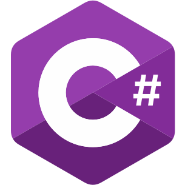

#  C#

## Upload a document and answer questions

Create a new .NET Console app and add package `Microsoft.KernelMemory.WebClient`, then add this code:

```csharp
using Microsoft.KernelMemory;

// Connected to the memory service running locally
var memory = new MemoryWebClient("http://127.0.0.1:9001/");

// Import a web page
await memory.ImportWebPageAsync(
    "https://raw.githubusercontent.com/microsoft/kernel-memory/main/README.md",
    documentId: "doc02");

// Wait for ingestion to complete, usually 1-2 seconds
Console.WriteLine("Waiting for memory ingestion to complete...");
while (!await memory.IsDocumentReadyAsync(documentId: "doc02"))
{
    await Task.Delay(TimeSpan.FromMilliseconds(1500));
}

// Ask a question
var answer = await memory.AskAsync("Is there a Kernel Memory community and how can I join?");

Console.WriteLine($"\nAnswer: {answer.Result}");
```

Run the application, and you should see:

{: .console }
> Answer: Yes, there is a Kernel Memory community. You can join the community by joining
> the [Kernel Memory Discord server](https://aka.ms/KMdiscord).