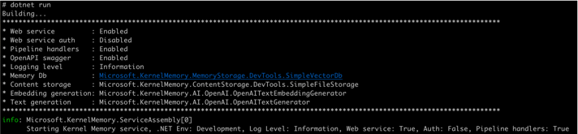
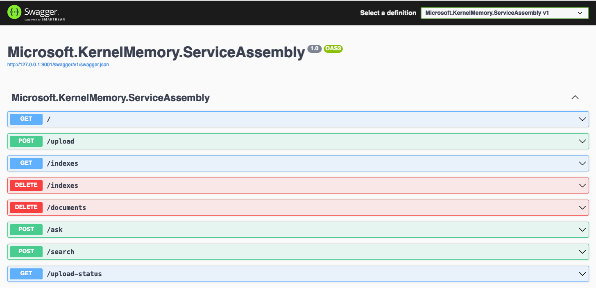

# Start the service

    cd service/Service
    dotnet run

You should see something similar in your console:

## Check OpenAPI swagger

In your browser open [http://127.0.0.1:9001/swagger/index.html](http://127.0.0.1:9001/swagger/index.html)

You should see the usual Swagger UI:

## Next: See KM in action

* [Python](python)
* [C#](csharp)
* [Java](java)
* [JavaScript](javascript)
* [Bash/curl](bash) 