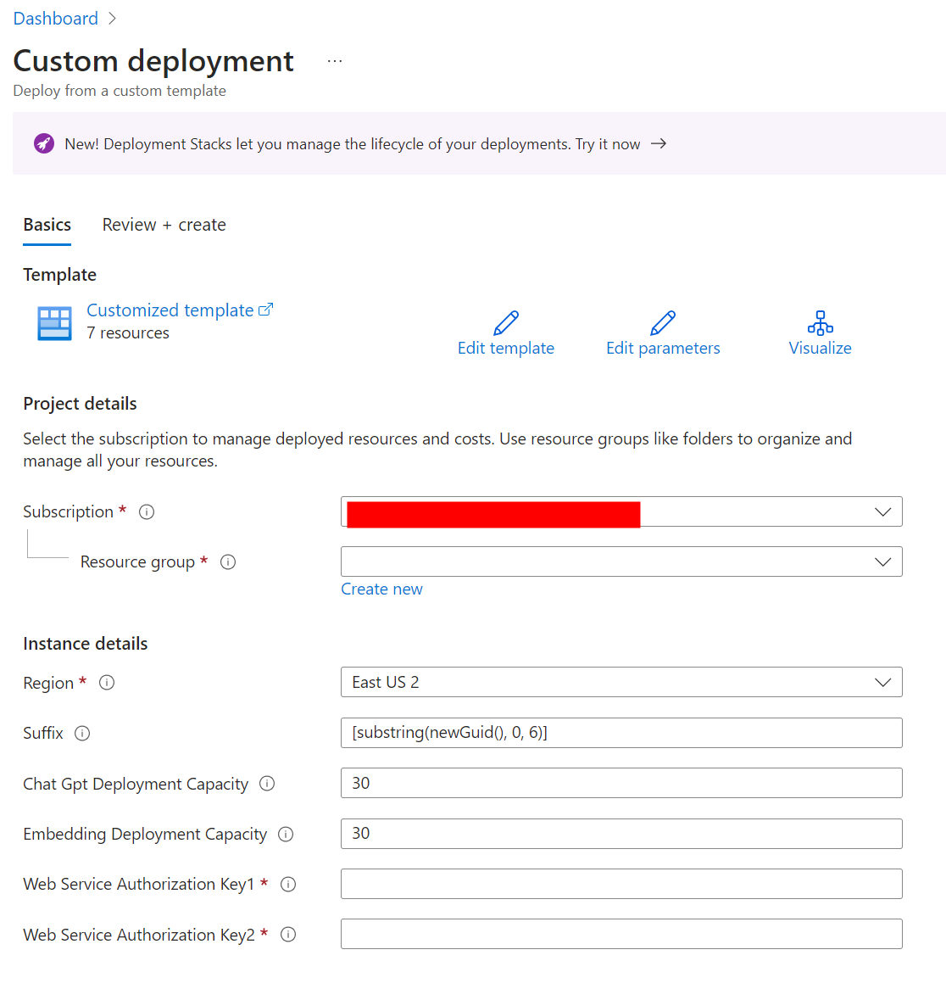

# Deploying Kernel Memory infrastructure to Azure

To deploy the Kernel Memory infrastructure to Azure, simply click the button below. This will create all the necessary resources.

## Resource Providers

The Azure subscription that you deploy this solution accelerator in will require `Microsoft.AlertsManagement`, `Microsoft.App` and `Microsoft.ContainerService` resource providers to be registered.
This can be accomplished via the [Azure Portal](https://learn.microsoft.com/en-us/azure/azure-resource-manager/management/resource-providers-and-types#azure-ortal) or with the following [Azure CLI](https://learn.microsoft.com/en-us/azure/azure-resource-manager/management/resource-providers-and-types#azure-cli) commands:

## Shell Script for Registering and Verifying Providers

```shell
# Register providers
az provider register --namespace Microsoft.AlertsManagement
az provider register --namespace Microsoft.App
az provider register --namespace Microsoft.ContainerService

# Verify providers were registered
az provider show --namespace Microsoft.AlertsManagement -o table
az provider show --namespace Microsoft.App -o table
az provider show --namespace Microsoft.ContainerService -o table
```

## Deployment

The deployment process may take up to 20 minutes.

[](https://aka.ms/KernelMemoryDeploy2Azure)

After clicking the button, you will be redirected to the Azure portal. You will need to fill parameters explained in the next section.

## Deployment Parameters



1. **Subscription**: Select the Azure subscription where you want to deploy the solution. Make sure you have the necessary permissions to create resources in the selected subscription. After the deployment is complete, you will see the following resources in your resource group:

   - Application Insights
   - Container Apps Environment
   - Log Analytics workspace
   - Search service
   - Container App
   - Managed Identity
   - OpenAI resource
   - Storage account
   - Public IP address
   - Application Gateway
   - Virtual network, Subnets, Network interfaces, Private Links, and Private DNS Zones

2. **Resource group**: We recommend creating a new resource group for each deployment.

3. **Region**: We recommend selecting a region for deployment or using an empty one.

   > [!WARNING]
   > Selec region where you have available Open AI model quotes.

4. **Suffix**: This value will be used to create unique names for the resources. You can leave this value unchanged.
5. **Tags**: Tags are a JSON object of key-value pairs that allow you to organize resources and manage costs.
6. **Kernel Memory Image Tag**: This value is used to specify the version of the Kernel Memory image to deploy. Modify this value if you want to deploy a specific version of the Kernel Memory image. Check available tags at [https://hub.docker.com/r/kernelmemory/service/tags](https://hub.docker.com/r/kernelmemory/service/tags).
7. **Inference Model**: This is the model that will be deployed to the OpenAI service. It's important to select a model that is available in the selected region.
8. **Inference Model Deployment Capacity**: This is the capacity of the inference deployment model, measured in Tokens-Per-Minute (TPM) and represented in thousands. The default capacity is 30, which corresponds to 30,000 TPM. For model limits specific to your region, refer to the documentation at [https://learn.microsoft.com/azure/ai-services/openai/concepts/models#standard-deployment-model-quota](https://learn.microsoft.com/azure/ai-services/openai/concepts/models#standard-deployment-model-quota).
9. **Embedding Model**: This is the model that will be deployed to the OpenAI service. It's important to select a model that is available in the selected region.
10. **Embedding Model Deployment Capacity**: This is the capacity of the embedding deployment model, measured in Tokens-Per-Minute (TPM) and represented in thousands. The default capacity is 30, which corresponds to 30,000 TPM. For model limits specific to your region, refer to the documentation at [https://learn.microsoft.com/azure/ai-services/openai/concepts/models#standard-deployment-model-quota](https://learn.microsoft.com/azure/ai-services/openai/concepts/models#standard-deployment-model-quota).
11. **Web Service Authorization Keys**: These keys should be unique values. We recommend using a random GUID generator like [https://guidgenerator.com/](https://guidgenerator.com/) to generate the values. Note these keys as you will need them to access the Kernel Memory API.

    > [!WARNING]
    > If you want to change the API keys after deployment. You can do this by updating the
    > `KernelMemory__ServiceAuthorization__AccessKey1` and `KernelMemory__ServiceAuthorization__AccessKey2` > **environment variables** in the Container App.
    >
    > Refer [to this screenshot](./images/ACA-EnvVar.png) or to the documentation
    > page: [Manage environment variables on Azure Container Apps](https://learn.microsoft.com/azure/container-apps/environment-variables?tabs=portal)
    > if you need help finding and changing environment variables.

12. **Virtual network** and **Subnet** address space and subnet address range parameters are needed to create the Virtual network and Subnet. Make sure that the vnet address space does not conflict with other Virtual networks in your subscription. Review [Azure Virtual Network concepts and best practices](https://learn.microsoft.com/azure/virtual-network/concepts-and-best-practices).

## Tips for customizing the deployment

Resources are deployed with an opinionated set of configurations. You can modify services on the Azure portal or you can reuse and customize the Bicep files starting from [infra/main.bicep](main.bicep).

> [!TIP]
> The `Deploy to Azure` button uses the [infra/main.json](main.json) file, which is a compiled version of [infra/main.bicep](main.bicep). Please note that the `main.json` file is not updated automatically when you make changes to the `main.bicep` file.
>
> You can use the `az bicep build -f main.bicep` command to compile the Bicep file to a JSON file.
>
> - [Click here](https://learn.microsoft.com/cli/azure/install-azure-cli) for instructions on installing `az`.
> - [Click here](https://learn.microsoft.com/azure/azure-resource-manager/bicep/bicep-cli) for Bicep CLI commands.

## Quickstart

You can start using Kernel Memory immediately after deployment. To find the IP address, navigate to the `Public IP address` deployed in your Resource group. If you need assistance, refer to [this screenshot](./images/Pip.png) (red marks are used to hide private information).

The Kernel Memory Web Service is deployed with `AuthenticationType` set to `APIKey`. To make requests, include the `Authorization` HTTP header with one of the two keys provided in the `Web Service Authorization Keys` during deployment.

> [!TIP]
> The easiest way to start using the Kernel Memory API is to use the Swagger UI. Access it by navigating to
> `{Application Url}/swagger/index.html` in your browser. Replace `km-service-example.example.azurecontainerapps.io`
> with your Application Url value.

Here is an example of how to create a `MemoryWebClient` instance and start using the Kernel Memory web service:

```csharp
var memory = new MemoryWebClient(
    "http://111.111.111.111/",
    apiKey: "...your WebServiceAuthorizationKey1...");
```

We recommend reviewing the [examples](../examples/) included in the repository, starting with
[001-dotnet-WebClient](../examples/001-dotnet-WebClient).
