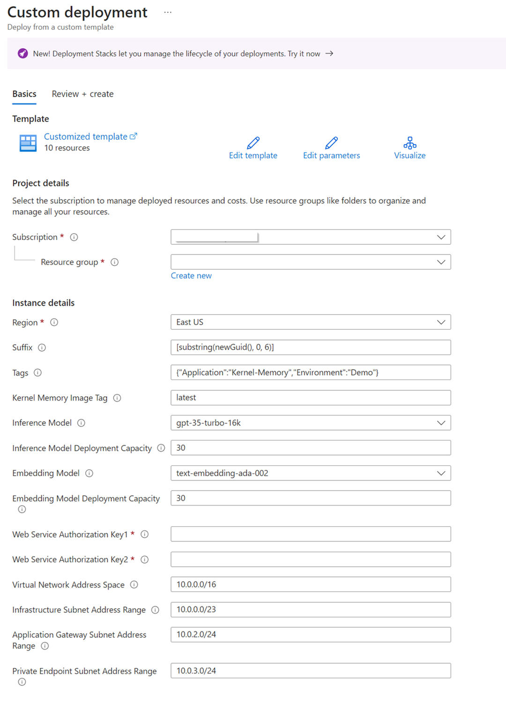

# Deploying Kernel Memory infrastructure to Azure

To deploy the Kernel Memory infrastructure to Azure, simply click the button below. This will create all the necessary resources. We recommend creating a new resource group for each deployment.

To deploy the Kernel Memory infrastructure to Azure, simply click the button below. This will create all the necessary resources. We recommend creating a new resource group for each deployment.

## Resource Providers

The Azure subscription that you deploy this solution accelerator in will require `Microsoft.AlertsManagement`, `Microsoft.App` and `Microsoft.ContainerService` resource providers to be registered.
This can be accomplished via the [Azure Portal](https://learn.microsoft.com/en-us/azure/azure-resource-manager/management/resource-providers-and-types#azure-ortal) or with the following [Azure CLI](https://learn.microsoft.com/en-us/azure/azure-resource-manager/management/resource-providers-and-types#azure-cli) commands:

```shell
# register providers
az provider register --namespace Microsoft.AlertsManagement
az provider register --namespace Microsoft.App
az provider register --namespace Microsoft.ContainerService
# verify providers were registered
az provider show --namespace Microsoft.AlertsManagement -o table
az provider show --namespace Microsoft.App -o table
az provider show --namespace Microsoft.ContainerService -o table
```

## Deployment

> [!WARNING]
> During the deployment you must select Models that your Azure Subscription is allowed to use.

[](https://portal.azure.com/#create/Microsoft.Template/uri/https%3A%2F%2Fraw.githubusercontent.com%2Fmicrosoft%2Fkernel-memory%2Fmain%2Finfra%2Fmain.json)

After clicking the button, you will be redirected to the Azure portal. You will need to fill in the following parameters:



    Important:

    1. We recommend creating a new resource group for each deployment or use an empty one.
    2. The deployment process may take up to 5 minutes.
    3. Make sure you pick region that has following models available for you
        modelName: 'gpt-35-turbo-16k' Version: '0613'
        modelName: 'text-embedding-ada-002' Version: '2'
    4. For Capacities we recommend using 30.  But each Azure Subscription has a unique limit.
    5. Web Service Authorization Key 1 and 2 should be unique values.  We recommend using random GUID generator like     https://guidgenerator.com/ to generate the values.

<details>

<summary>Tips for customizing the deployment</summary>

Resources are deployed with an opinionated set of configurations. You can modify services on Azure portal or you can
reuse and customize the Bicep files starting from [infra/main.bicep](main.bicep).

> [!TIP]
> The `Deploy to Azure` button uses the [infra/main.json](main.json) file, which is a compiled version of
> [infra/main.bicep](main.bicep). Please note that the `main.json` file is not updated automatically when you
> make changes to `main.bicep` file.
>
> You can use the `az bicep build -f main.bicep` command to compile the Bicep file to a json file.
>
> - [Click here](https://learn.microsoft.com/cli/azure/install-azure-cli) for `az` install instructions
> - [Click here](https://learn.microsoft.com/azure/azure-resource-manager/bicep/bicep-cli) for Bicep CLI commands

</details>

After the deployment is complete, you will see the following resources in your resource group:

- Application Insights
- Container Apps Environment
- Log Analytics workspace
- Search service
- Container App
- Managed Identity
- Storage account
- Public IP address
- Application Gateway
- Virtual network, Subnets, Network interfaces, Private Links and Private DNS Zones

You can start using Kernel Memory immediately after deployment. Navigate to `Public IP address` deployed in your Resource group and find `IP address`. Refer [to this screenshot](./images/Pip.png) (red marked used to hide private information) if you need help finding IP address value.

Kernel Memory web service is deployed with `AuthenticationType` set to `APIKey` and default API keys are random GUIDs. Each request requires the `Authorization` HTTP header, passing one of the two keys.

> [!WARNING]
> If you want to change the API keys after deployment. You can do this by updating the
> `KernelMemory__ServiceAuthorization__AccessKey1` and `KernelMemory__ServiceAuthorization__AccessKey2` > **environment variables** in the Container App.
>
> Refer [to this screenshot](./images/ACA-EnvVar.png) or to the documentation
> page: [Manage environment variables on Azure Container Apps](https://learn.microsoft.com/azure/container-apps/environment-variables?tabs=portal)
> if you need help finding and changing environment variables.

> [!TIP]
> The easiest way to start using Kernel Memory API is to use Swagger UI. You can access it by navigating to
> `{Application Url}/swagger/index.html` in your browser. Replace `km-service-example.example.azurecontainerapps.io`
> with your Application Url value.

Here is an example of how to create a `MemoryWebClient` instance and start using Kernel Memory web service:

```csharp
var memory = new MemoryWebClient(
    "http://111.111.111.111/",
    apiKey: "...your WebServiceAuthorizationKey1...");
```

We recommend reviewing the [examples](../examples/) included in the repository, e.g. starting from
[001-dotnet-WebClient](../examples/001-dotnet-WebClient).
